# Phase S15 PLAN.md — CRITICAL 버그 수정 + ML 파이프라인 연결

> **Phase**: S15 (회귀 — TF SF 9H 중단 후)
> **US 범위**: US-245 ~ US-259-a (17 US)
> **목표**: CRITICAL 6건 + 수학 오류 3건 해결, ML 3모듈 background loop 연결
> **선행 조건**: Entry Gate CONDITIONAL PASS (DRIFT 수정 완료)
> **작성일**: 2026-03-19

---

## 1. 배치 그룹 + 의존성 그래프

### 1.1 배치 요약

| 배치 | US 수 | 테마 | 병렬 가능 | 예상 난이도 |
|------|-------|------|----------|-----------|
| Batch 1 | 4 | CRITICAL 버그 (독립) | 4개 모두 병렬 | MEDIUM |
| Batch 2 | 5 | 전략 연결 | 3 병렬 + 2 순차 | HIGH |
| Batch 3 | 3 | 인프라/영속화 | 3개 모두 병렬 | MEDIUM |
| Batch 4 | 3 | ML 파이프라인 | 순차 (US-251 → 252 → 253) | HIGH |
| Batch 5 | 1 | 기타 | 독립 | LOW |
| Batch 6 | 1 | 통합 검증 | 전체 의존 | HIGH |

### 1.2 의존성 그래프 (Mermaid)

```mermaid
graph TD
    subgraph "Batch 1 — CRITICAL 버그 (병렬)"
        US257["US-257: profit_factor 금액 비율 수정"]
        US246["US-246: LiveGate 실행 경로 강제"]
        US247["US-247: estimate_cost→calculate 통합"]
        US248["US-248: ADV/sigma 동적 계산"]
    end

    subgraph "Batch 2 — 전략 연결"
        US245["US-245: stat_arb regime_detector 주입"]
        US249["US-249: 삼각 leg sizing 보정"]
        US255["US-255: AdaptiveThreshold 전략별 분리"]
        US254["US-254: RegimeDetector 전 전략 연결"]
        US258b["US-258-b: warm-up 추적"]
    end

    subgraph "Batch 3 — 인프라/영속화 (병렬)"
        US250["US-250: 포지션 리커버리+리콘실러"]
        US250a["US-250-a: ComplianceChecker startup"]
        US256["US-256: peak_equity DB 영속화"]
    end

    subgraph "Batch 4 — ML 파이프라인 (순차)"
        US251["US-251: HMM Trainer 루프"]
        US252["US-252: XGBoost+ONNX"]
        US253["US-253: Feature→ONNX Scorer"]
    end

    subgraph "Batch 5 — 기타"
        US258a["US-258-a: ShadowMiniTuner 활성/제거"]
    end

    subgraph "Batch 6 — 통합 검증"
        US259a["US-259-a: 통합 Shadow 10min"]
    end

    %% 의존성
    US245 --> US254
    US251 --> US252
    US252 --> US253

    %% Batch 6 전체 의존
    US257 --> US259a
    US246 --> US259a
    US247 --> US259a
    US248 --> US259a
    US245 --> US259a
    US249 --> US259a
    US255 --> US259a
    US254 --> US259a
    US258b --> US259a
    US250 --> US259a
    US250a --> US259a
    US256 --> US259a
    US251 --> US259a
    US252 --> US259a
    US253 --> US259a
    US258a --> US259a
```



---

## 2. TeamCreate 구성 (IVE 팀원별 배치 배정)

### 2.1 팀원 배정

| 팀원 | 배치 | US | 근거 |
|------|------|-----|------|
| **Yujin** (executor) | Batch 1 | US-257, US-246 | CRITICAL 최우선, shadow.py + live_gate.py + main.py |
| **Gaeul** (executor) | Batch 1 → 2 | US-247, US-248 → US-249 | cost_calculator.py + signal.py 소유, 이후 triangular.py |
| **Leeseo** (executor) | Batch 3 | US-250, US-250-a, US-256 | 인프라 파일 (recovery, reconciler, compliance, main.py peak_equity) |
| **Liz** (executor) | Batch 2 → 4 | US-245, US-254, US-255 → US-251~253 | stat_arb + regime + ML 전문 (main.py 전략 등록 + ml/ 디렉토리) |
| **Wonyoung** (test-engineer) | 전체 | 각 배치 완료 시 테스트 작성 | 배치별 pytest 작성 + 회귀 테스트 |
| **Rei** (designer) | 미사용 | - | UI 변경 없음 |

### 2.2 실행 타임라인

```
Phase 1 (병렬): Yujin(B1) + Gaeul(B1) + Leeseo(B3) + Liz(B2-전반)
                Wonyoung: B1/B3 테스트 작성
Phase 2 (순차): Gaeul(US-249) + Liz(US-254, dep:US-245)
                Yujin(US-258-b, US-258-a)
                Wonyoung: B2 테스트 작성
Phase 3 (순차): Liz(US-251 → US-252 → US-253)
                Wonyoung: B4 테스트 작성
Phase 4:        US-259-a 통합 Shadow 10min (전원)
```

---

## 3. 파일 소유권 매트릭스

| 파일 | 소유자 | US | 충돌 위험 |
|------|--------|-----|----------|
| `src/modes/shadow.py` | Yujin | US-257, US-258-b, US-258-a, US-256 | HIGH — Yujin 전담 |
| `src/modes/live_gate.py` | Yujin | US-246 | LOW |
| `src/main.py` | Liz (전략 등록) / Leeseo (인프라) / Yujin (LiveGate) | US-245, US-246, US-250, US-250-a, US-251, US-252, US-256 | **CRITICAL** — 순차 머지 필수 |
| `src/core/signal.py` | Gaeul | US-248, US-255 | MEDIUM |
| `src/friction/cost_calculator.py` | Gaeul | US-247 | LOW |
| `src/strategies/triangular.py` | Gaeul | US-249 | LOW |
| `src/strategies/statistical_arb.py` | Liz | US-245, US-258-b | LOW |
| `src/tuning/adaptive_threshold.py` | Liz | US-255 | LOW |
| `src/strategies/*.py` (6개) | Liz | US-254 | MEDIUM — regime 인터페이스만 추가 |
| `src/execution/position_recovery.py` | Leeseo | US-250 | LOW |
| `src/execution/reconciler.py` | Leeseo | US-250 | LOW |
| `src/infra/compliance.py` | Leeseo | US-250-a | LOW |
| `src/ml/hmm_trainer.py` | Liz | US-251 | LOW |
| `src/ml/xgb_trainer.py` | Liz | US-252 | LOW |
| `src/ml/onnx_runtime.py` | Liz | US-252, US-253 | LOW |
| `src/ml/feature_pipeline.py` | Liz | US-253 | LOW |
| `src/ml/canary.py` | Liz | US-253 | LOW |
| `src/tuning/scheduled_tuner.py` | Yujin | US-258-a | LOW |

**main.py 충돌 방지 전략**: Batch 1(Yujin: LiveGate) → Batch 2(Liz: 전략 등록) → Batch 3(Leeseo: 인프라) → Batch 4(Liz: ML) 순서로 main.py 수정. 동시 수정 금지.

---

## 4. US별 상세 작업 + AC (Acceptance Criteria)

### Batch 1 — CRITICAL 버그 (독립, 즉시 수정)

#### US-257: profit_factor 금액 비율 수정
- **파일**: `src/modes/shadow.py:2201`
- **현재 버그**: `profit_factor = trades_won / trades_lost` (건수 비율)
- **수정**: `profit_factor = total_profit / abs(total_loss)` (금액 비율)
- **수학 근거**: SSOT.md §2 — "Profit Factor > 1.0 (총이익/총손실)"
- **구현**:
  ```
  # 변경 전 (shadow.py:2201)
  profit_factor = (float(self._stats.trades_won) / max(1, float(self._stats.trades_lost)))

  # 변경 후
  profit_factor = (float(self._stats.total_profit) / max(0.01, abs(float(self._stats.total_loss))))
  ```
- **AC**:
  1. profit_factor가 금액 기반으로 계산됨 (총이익/총손실)
  2. total_loss=0일 때 ZeroDivisionError 없음 (max(0.01, ...) 가드)
  3. AdaptiveThreshold.adjust()에 올바른 profit_factor 전달
  4. 기존 테스트 PASS + 새 테스트 2개 (금액 비율 검증, 경계값)
- **WIRING AC**:
  - 생성: `_stats.total_profit`, `_stats.total_loss` 필드 확인/추가
  - 주입: `_shadow_adaptive_threshold_loop()` 내 profit_factor 계산식 교체
  - 호출: AdaptiveThreshold.adjust(profit_factor=...) 호출 경로 검증

#### US-246: LiveGate 실행 경로 강제
- **파일**: `src/modes/live_gate.py:313-317`, `src/main.py`
- **현재 버그**: `is_live_eligible()`는 passive 조회만 — 실행 경로에서 차단하지 않음
- **수정**: Engine.run()에서 `EXECUTION_MODE=live` 시 LiveGate.evaluate() 호출, 불통과 시 shadow로 fallback
- **AC**:
  1. `EXECUTION_MODE=live`일 때 LiveGate.evaluate() 강제 실행
  2. 6-check 미통과 시 live 진입 차단 + Telegram 알림 + shadow fallback
  3. 기존 `is_live_eligible()` 유지 (하위 호환)
  4. 테스트: LiveGate FAIL 시 live 차단 검증
- **WIRING AC**:
  - 생성: `_enforce_live_gate()` 메서드 (main.py)
  - 주입: Engine.run() 초기화 시퀀스에 게이트 삽입
  - 호출: live mode 진입 전 `_enforce_live_gate()` → evaluate() → eligible 체크

#### US-247: estimate_cost → calculate 통합
- **파일**: `src/friction/cost_calculator.py:110-128`, 전략 3개 (triangular, spot_futures, funding_rate)
- **현재 버그**: `estimate_cost()`는 taker_fee + network_cost만 반환 — slippage, rollback, opportunity cost 누락
- **수정**: estimate_cost()를 calculate()의 lightweight wrapper로 교체하거나, 전략 호출부에서 calculate() 직접 사용
- **주의**: SignalGenerator가 CEXOrderbookSlippage를 이미 적용 → 이중 슬리피지 금지
- **AC**:
  1. estimate_cost()가 fee + network + rollback_expected 포함 (slippage 제외 — 이중 계산 방지)
  2. 전략별 on_signal()에서 올바른 비용 함수 호출
  3. 이중 슬리피지 검증 테스트 (PowerLaw k=0.0 확인)
  4. 기존 4,843 테스트 PASS
- **WIRING AC**:
  - 생성: estimate_cost() 내부에 rollback_expected 추가
  - 주입: 전략 on_signal() → estimate_cost() 호출 경로 확인
  - 호출: triangular.py:103, spot_futures, funding_rate에서 estimate_cost() 사용 검증

#### US-248: ADV/sigma 동적 계산
- **파일**: `src/core/signal.py:51-52, 244-246, 284-287`
- **현재 버그**: `default_adv=1000`, `default_sigma=0.001` 하드코딩
- **수정**: 실 오더북 depth + 가격 변동률에서 ADV/sigma 동적 계산
- **수학 근거**: SSOT.md §4.1 — `impact_fraction = sigma * k * sqrt(size / ADV)`
- **AC**:
  1. ADV: 최근 N분 체결량 또는 오더북 L1~L5 depth 합산으로 추정
  2. sigma: 최근 N분 mid-price 수익률의 표준편차
  3. fallback: 데이터 부족 시 기존 default 유지 (1000, 0.001)
  4. ML feature stub 3개 → 실 피처로 교체 (signal.py:284-287)
  5. 테스트: 동적 ADV/sigma가 default와 다른 값 반환 검증
- **WIRING AC**:
  - 생성: `_compute_dynamic_adv()`, `_compute_dynamic_sigma()` 메서드
  - 주입: SignalGenerator.__init__()에서 PriceHub 참조 보유
  - 호출: calculate() 호출 시 동적 값 전달

---

### Batch 2 — 전략 연결

#### US-245: stat_arb regime_detector 주입
- **파일**: `src/main.py:898`, `src/strategies/statistical_arb.py`
- **현재 버그**: `StatisticalArbStrategy("statistical_arb_v1", cost_calc)` — regime_detector 미전달
- **수정**: 생성자에 `regime_detector=self._regime_detector` 추가
- **AC**:
  1. StatisticalArbStrategy가 regime_detector 수신
  2. regime=CRISIS 시 신규 진입 차단 (기존 포지션 유지)
  3. regime_detector=None일 때 graceful fallback (무조건 진입 허용)
  4. 테스트: regime CRISIS 시 on_signal() 스킵 검증

#### US-249: 삼각 leg sizing 보정
- **파일**: `src/strategies/triangular.py:134-145`
- **현재 버그**: 3개 leg 모두 동일 `size` 사용 — 통화 불일치 (BTC/USDT leg vs ETH/BTC leg)
- **수정**: 각 leg별 통화 기준 size 변환 (USDT → base asset 환산)
- **수학**:
  ```
  Leg 1: BUY BTC/USDT — size = position_usdt / btc_price (BTC 단위)
  Leg 2: BUY ETH/BTC  — size = btc_amount / eth_btc_price (ETH 단위)
  Leg 3: SELL ETH/USDT — size = eth_amount (ETH 단위)
  ```
- **AC**:
  1. 각 leg의 size가 해당 base asset 단위로 정확히 환산
  2. 3-leg 순환 후 USDT 잔액 변화 = expected_profit (오차 < 0.1%)
  3. 기존 fake spread 필터(>5%) 유지
  4. 테스트: BTC/ETH/USDT 삼각 경로 size 변환 정확성

#### US-255: AdaptiveThreshold 전략별 분리
- **파일**: `src/tuning/adaptive_threshold.py`, `src/core/signal.py`
- **현재 버그**: 글로벌 단일 AdaptiveThreshold 인스턴스 — 전략별 특성 미반영
- **수정**: 전략별 AdaptiveThreshold 인스턴스 생성 (Dict[strategy_id, AdaptiveThreshold])
- **AC**:
  1. 전략별 독립 edge_bps 조정 (cross_exchange vs triangular 등)
  2. 기존 글로벌 인스턴스 하위 호환 유지 (default fallback)
  3. Shadow 로그에서 전략별 edge_bps 확인 가능
  4. 테스트: 두 전략의 edge_bps 독립 조정 검증

#### US-254: RegimeDetector 전 전략 연결 (dep: US-245)
- **파일**: 6개 전략 파일 (cross_exchange, spot_futures, futures_futures, triangular, funding_rate, statistical_arb)
- **수정**: 모든 전략에 regime_detector optional 파라미터 추가, CRISIS 시 신규 진입 차단
- **AC**:
  1. 6개 전략 모두 regime_detector 수신 가능
  2. CRISIS → 진입 차단, TRENDING/MEAN_REVERTING → 정상
  3. regime_detector=None → 기존 동작 유지
  4. main.py _register_default_strategies()에서 전략 생성 시 regime_detector 전달
  5. 테스트: 전략별 regime 차단 검증

#### US-258-b: warm-up 추적
- **파일**: `src/strategies/statistical_arb.py`, `src/modes/shadow.py`
- **수정**: stat_arb min_history(120) 미달 시 "warming up" 상태 표시, Shadow 메트릭에 포함
- **AC**:
  1. warm-up 기간 중 거래 발생 안 함 (정상 동작)
  2. Shadow 로그에 warm-up 상태 표시
  3. 13항목 복합지표에서 warm-up 중인 전략은 "trade >= 1" 체크 제외
  4. 테스트: min_history 미달 시 on_signal() 스킵 + warm-up 로그 확인

---

### Batch 3 — 인프라/영속화 (독립)

#### US-250: 포지션 리커버리 + 리콘실러 startup 연결
- **파일**: `src/main.py`, `src/execution/position_recovery.py`, `src/execution/reconciler.py`
- **수정**: Engine 시작 시 PositionRecovery.scan() + PositionReconciler 주기적 실행 연결
- **AC**:
  1. Engine 시작 시 미정리 포지션 스캔 + 로그
  2. PositionReconciler 60초 주기 background task 등록
  3. reconciliation 불일치 시 Telegram 알림
  4. 테스트: 미정리 포지션 존재 시 recovery 동작 검증

#### US-250-a: ComplianceChecker startup
- **파일**: `src/main.py`, `src/infra/compliance.py`
- **수정**: Engine 시작 시 ComplianceChecker.audit() 실행, FAIL 시 경고
- **AC**:
  1. Engine 시작 시 자동 compliance audit
  2. CRITICAL 위반 시 시작 차단 (configurable)
  3. 결과 로그 기록
  4. 테스트: compliance 위반 시 경고 동작 검증

#### US-256: peak_equity DB 영속화
- **파일**: `src/main.py:116`, `src/modes/shadow.py`
- **현재 버그**: `_peak_equity` 메모리만 — 재시작 시 리셋
- **수정**: TimescaleDB에 peak_equity 저장/복원
- **AC**:
  1. Engine 시작 시 DB에서 최근 peak_equity 로드
  2. peak_equity 갱신 시 DB에 비동기 저장 (5분 주기 또는 갱신 시)
  3. DB 미연결 시 메모리 fallback (기존 동작)
  4. 테스트: DB 저장/복원 + fallback 검증

---

### Batch 4 — ML 파이프라인 (순차)

#### US-251: HMM Trainer 루프
- **파일**: `src/main.py`, `src/ml/hmm_trainer.py`
- **현재**: HMMTrainer 클래스 존재, background loop 미연결
- **수정**: main.py에서 HMMTrainer를 background task로 등록 (24h 주기 재학습)
- **AC**:
  1. HMMTrainer.train() background task 등록 (asyncio.create_task)
  2. 학습 완료 시 RegimeDetector 모델 교체 (hot-swap)
  3. 학습 실패 시 기존 모델 유지 (graceful fallback)
  4. hmmlearn 미설치 시 건너뜀 (ImportError catch)
  5. 테스트: mock DB → train → detect 파이프라인 검증

#### US-252: XGBoost + ONNX 학습 루프
- **파일**: `src/main.py`, `src/ml/xgb_trainer.py`, `src/ml/onnx_runtime.py`
- **현재**: 클래스 존재, main.py 미연결
- **수정**: XGBTrainer background task + ONNX export + ONNXSignalScorer 모델 교체
- **AC**:
  1. XGBTrainer.train() background task (24h 주기)
  2. 학습 완료 → ONNX export → ONNXSignalScorer.reload()
  3. xgboost/onnxruntime 미설치 시 건너뜀
  4. 테스트: train → export → load → predict 파이프라인

#### US-253: Feature → ONNX Scorer 연결 (dep: US-252)
- **파일**: `src/core/signal.py:284-287`, `src/ml/feature_pipeline.py`, `src/ml/canary.py`
- **현재**: signal.py에서 ML feature stub 3개만 (`net_edge, trade_size, sigma`)
- **수정**: MLFeaturePipeline.extract() → 20개 피처 → ONNXSignalScorer.predict_signal()
- **AC**:
  1. signal.py에서 MLFeaturePipeline 20개 피처 추출
  2. ONNX 모델 존재 시 predict_signal() 호출 → confidence 보정
  3. 모델 미존재 시 기존 로직 유지 (fallback)
  4. MLCanary 단계별 rollout (DISABLED → SHADOW → PARTIAL → FULL)
  5. 테스트: 20개 피처 추출 + ONNX 스코어링 + canary 단계 전환

---

### Batch 5 — 기타

#### US-258-a: ShadowMiniTuner 활성화 또는 제거
- **파일**: `src/modes/shadow.py:685-692`, `src/tuning/scheduled_tuner.py:345-440`
- **현재**: ShadowMiniTuner 코드 존재, `run_in_thread()` 호출하지만 `shadow_elapsed_seconds` 미전달
- **판단 기준**: TF SF Stage 3 결과(PROVEN/NEUTRAL/HARMFUL) 기반
- **AC**:
  1. 활성화: `shadow_elapsed_seconds` 올바르게 전달 + 결과 로그
  2. 또는 제거: dead code 정리 + 관련 테스트 제거
  3. 결정은 Shadow 실행 결과에 따라 판단

---

### Batch 6 — 통합 검증

#### US-259-a: 통합 Shadow 10min
- **의존성**: Batch 1~5 전체 완료
- **AC**: 아래 §6 Shadow 검증 체크리스트 13항목 전체 PASS

---

## 5. pytest 전략 (배치별 테스트 범위)

### 5.1 Batch 1 테스트

| US | 테스트 파일 | 케이스 수 | 핵심 검증 |
|-----|-----------|---------|----------|
| US-257 | `tests/test_shadow_profit_factor.py` | 4 | 금액 비율, 경계값(loss=0), AdaptiveThreshold 연동 |
| US-246 | `tests/test_live_gate_enforce.py` | 3 | 게이트 차단, fallback shadow, Telegram 알림 |
| US-247 | `tests/test_cost_calculator_v2.py` | 5 | rollback 포함, 이중 슬리피지 방지, 전략별 호출 |
| US-248 | `tests/test_dynamic_adv_sigma.py` | 4 | 동적 계산, fallback, ML feature 교체 |

### 5.2 Batch 2 테스트

| US | 테스트 파일 | 케이스 수 | 핵심 검증 |
|-----|-----------|---------|----------|
| US-245 | `tests/test_stat_arb_regime.py` | 3 | regime 주입, CRISIS 차단, None fallback |
| US-249 | `tests/test_triangular_sizing.py` | 4 | leg별 통화 변환, 순환 잔액 검증, fake spread |
| US-255 | `tests/test_adaptive_per_strategy.py` | 3 | 전략별 독립 조정, fallback |
| US-254 | `tests/test_regime_all_strategies.py` | 6 | 6개 전략 regime 수신, CRISIS 차단 |
| US-258-b | `tests/test_stat_arb_warmup.py` | 2 | warm-up 스킵, Shadow 메트릭 제외 |

### 5.3 Batch 3 테스트

| US | 테스트 파일 | 케이스 수 | 핵심 검증 |
|-----|-----------|---------|----------|
| US-250 | `tests/test_position_recovery_startup.py` | 3 | scan, reconcile 주기, Telegram |
| US-250-a | `tests/test_compliance_startup.py` | 2 | audit 실행, CRITICAL 차단 |
| US-256 | `tests/test_peak_equity_persist.py` | 3 | DB 저장, 복원, fallback |

### 5.4 Batch 4 테스트

| US | 테스트 파일 | 케이스 수 | 핵심 검증 |
|-----|-----------|---------|----------|
| US-251 | `tests/test_hmm_trainer_loop.py` | 3 | background task, hot-swap, ImportError |
| US-252 | `tests/test_xgb_onnx_loop.py` | 3 | train→export→load, graceful fallback |
| US-253 | `tests/test_ml_feature_scoring.py` | 4 | 20 피처, ONNX 스코어링, canary 단계 |

### 5.5 회귀 테스트

```bash
# 전체 회귀 (배치 완료 시마다)
cd engine && python -m pytest tests/ -x --tb=short

# 빠른 검증 (개별 US 완료 시)
cd engine && python -m pytest tests/test_shadow_profit_factor.py tests/test_live_gate_enforce.py -v
```

**목표**: 기존 4,843 PASS 유지 + 신규 ~45개 추가 → 4,888+ tests

---

## 6. Shadow 검증 체크리스트 (13항목 복합지표)

> US-259-a 통합 Shadow 10min에서 전항목 검증

| # | 체크 | 임계값 | 검증 방법 |
|---|------|--------|----------|
| 1 | crash | = 0 | 프로세스 exit code 0 |
| 2 | 무중단 실행 | >= 10분 | elapsed_seconds >= 600 |
| 3 | PnL | >= $0 | shadow stats total_pnl |
| 4 | Max Drawdown | < 5% | peak_equity 기반 계산 (US-256 DB 영속화 반영) |
| 5 | Profit Factor | > 1.0 | **금액 비율** (US-257 수정 반영) |
| 6 | 신호 수 | >= 100/day (외삽) | 10min: >= 70 signals |
| 7 | Kill Switch | Not halted | kill_switch.is_halted == False |
| 8 | Circuit Breaker | CLOSED | circuit_breaker.state == CLOSED |
| 9 | 거래소 Health | >= 95% | min(exchange_health_scores) >= 0.95 |
| 10 | loss_capped | = 0 | TRADE_LOSS_CAPPED counter |
| 11 | 전략별 trade | 모든 활성 전략 trade >= 1 | warm-up 전략 제외 (US-258-b) |
| 12 | 방어 레이어 활성 | CB/StaleDetector/OutlierFilter 로그 >= 1건 | structlog grep |
| 13 | 결과 파일 | `.omc/state/shadow-result-latest.json` 존재 | 검증 증거 |

**추가 검증 (Phase S15 특화)**:
- profit_factor가 금액 비율인지 확인 (US-257)
- LiveGate enforce 로그 존재 확인 (US-246)
- RegimeDetector 연결 로그 6개 전략 확인 (US-254)
- ML background task 시작 로그 확인 (US-251~253, ImportError 시 스킵 허용)
- peak_equity DB write 로그 확인 (US-256)

---

## 7. 리스크 목록

| # | 리스크 | 영향 | 완화 |
|---|--------|------|------|
| R1 | **main.py 동시 수정 충돌** | 4명이 main.py 수정 | 순차 머지 정책 (§3 매트릭스), 함수 단위 분리 |
| R2 | **6개 전략 동시 수정 회귀** | US-254 regime 인터페이스 추가 시 기존 동작 변경 | regime_detector=None 하위 호환 필수, 전략별 개별 테스트 |
| R3 | **ML 학습 데이터 부재** | HMM/XGBoost 학습 시 TimescaleDB 데이터 필요 | mock 데이터 테스트 + shadow 실행 시 실 데이터 자동 축적 |
| R4 | **이중 슬리피지 재발** | US-247 cost 통합 시 slippage 이중 계산 | CEXOrderbookSlippage는 SignalGenerator 전용, estimate_cost()에서 slippage 제외 검증 |
| R5 | **hmmlearn/xgboost/onnxruntime 미설치** | ML 모듈 ImportError | 모든 ML import에 try/except + graceful skip, 핵심 기능에 영향 없음 |
| R6 | **삼각 sizing 오류 전파** | US-249 통화 변환 수학 오류 시 손실 | unit test에서 3-leg 순환 잔액 검증 (오차 < 0.1%) |
| R7 | **peak_equity DB 스키마** | 새 테이블/컬럼 필요 | migration_runner 사용, DB 미연결 시 메모리 fallback |

---

## 8. 성공 기준

1. **전체 테스트**: 4,888+ passed, 0 failed
2. **Shadow 13항목**: 전항목 PASS (특히 profit_factor 금액 비율)
3. **CRITICAL 0건**: 6개 CRITICAL 전부 해소
4. **수학 오류 0건**: 3개 수학 버그 전부 해소
5. **ML 연결**: 3개 ML 모듈 background loop 등록 (ImportError 시 graceful skip)
6. **LiveGate 차단**: live mode 진입 시 6-check 강제 + 미통과 차단 동작 확인
7. **회귀 없음**: 기존 4,843 테스트 전부 PASS

---

## 9. Assembly Gate 체크리스트 (C-Step 0.5)

> Phase 완료 후 코드리뷰 전 필수 검증

- [ ] init chain: 17개 US의 새 컴포넌트가 Engine.__init__() → run() 경로에서 올바르게 초기화
- [ ] signal flow: RegimeDetector → 6개 전략, ML Scorer → SignalGenerator 연결 확인
- [ ] dead wiring: 미사용 import, 미호출 메서드 없음
- [ ] config audit: 새 env var, 새 config 키 문서화 (.env.example + SSOT.md)
