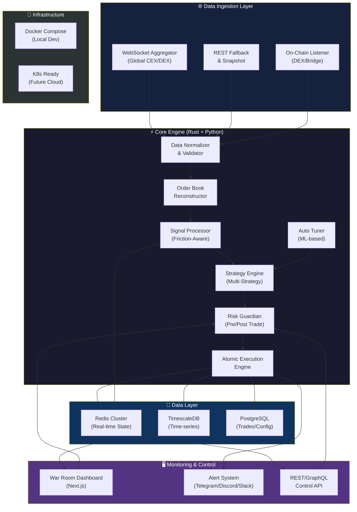
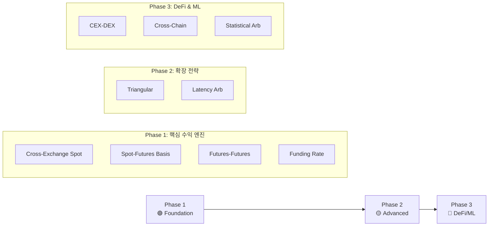
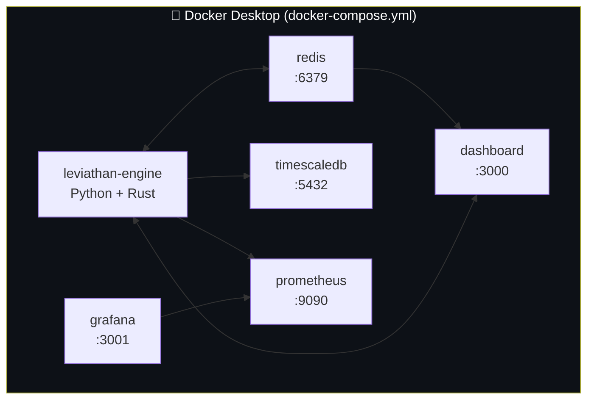
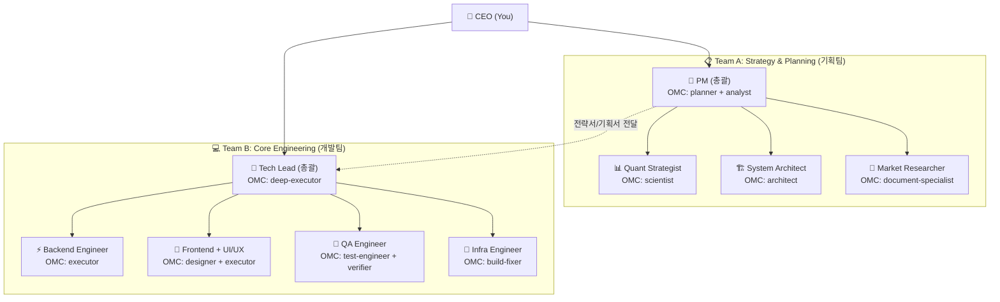
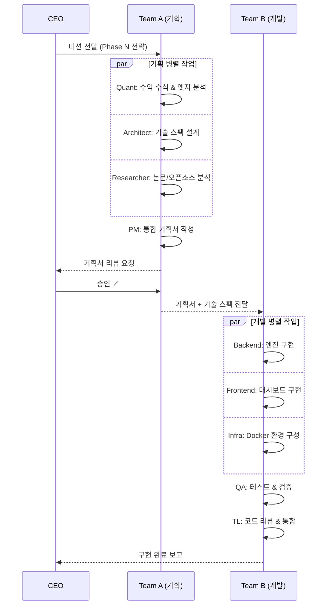
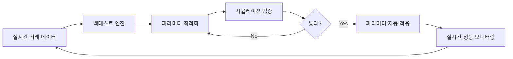
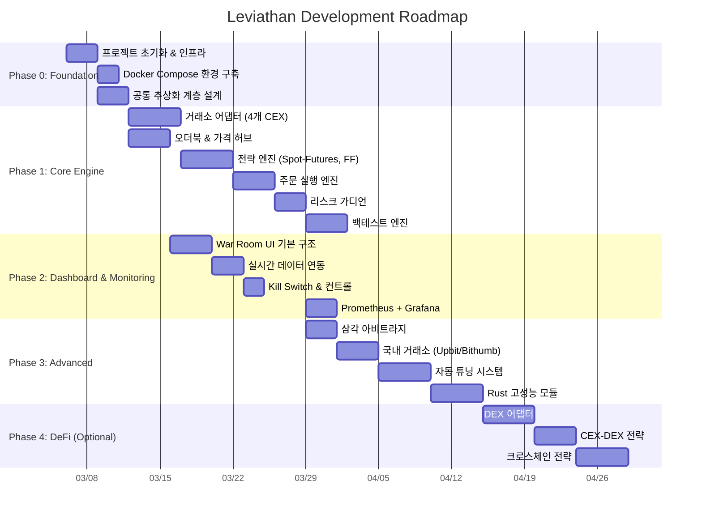

# 🐉 LEVIATHAN — Global Arbitrage Engine V3 기획안 초안

> **목적:** OMC Deep Interview를 통해 구체화하기 위한 **기획 초안(Draft Blueprint)**
> **작성일:** 2026-03-05 | **프로젝트:** `arbitrage_OMC`

---

## 0. Executive Summary

전 세계 CEX/DEX를 아우르는 **상용급 종합 아비트라지 엔진**을 **처음부터 완전히 새로 구축**한다.
기존 프로젝트의 문제점(모듈 결합, 설정 누락, 테스트 부재, 단일 전략)을 모두 극복하고,
**마이크로초(μs) 레이턴시**, **99.9% 업타임**, **자동 튜닝**, **실시간 리스크 가드**를 목표로 한다.

> [!IMPORTANT]
> 이것은 기존 프로젝트의 업그레이드가 **아닙니다**. 완전한 신규 구축(Greenfield)입니다.
> 최신 논문, 오픈소스(NautilusTrader, Hummingbot, QuantConnect 등), 상용 시스템을 분석한 결과를 기반으로 설계합니다.

---

## 1. 아키텍처 개요

### 1.1 시스템 전체 아키텍처



### 1.2 핵심 설계 원칙

| 원칙 | 설명 |
|------|------|
| **Friction-First** | 수수료, 슬리피지, 네트워크 지연, API 레이턴시를 0.01% 오차 이내로 모델링 |
| **Event-Driven** | 모든 시그널은 이벤트 기반으로 처리 (Polling 금지) |
| **Zero-Copy** | 데이터 직렬화 최소화, 메모리 내 공유 상태 활용 |
| **Fail-Safe** | 모든 실행에 롤백 로직, 서킷 브레이커, 킬 스위치 내장 |
| **Modular** | 완벽한 추상화/모듈화로 중복 코드 제로, 전략 핫 스왑 가능 |
| **Observable** | 모든 내부 상태를 실시간으로 모니터링 가능 |

---

## 2. 아비트라지 전략 매트릭스 (ALL STRATEGIES)

> [!TIP]
> 기존 봇은 Spot-Futures, Futures-Futures 2개 전략만 지원했습니다.
> Leviathan은 **8개 이상의 전략**을 동시에 운용합니다.

### 2.1 전략 목록

| # | 전략명 | 유형 | 설명 | 복잡도 |
|---|--------|------|------|--------|
| 1 | **Cross-Exchange Spot** | CEX-CEX | 거래소 A 현물 매수 → 거래소 B 현물 매도 | ★★☆ |
| 2 | **Spot-Futures Basis** | CEX 내부 | 현물 매수 + 선물 숏 → 베이시스 수렴 시 청산 | ★★★ |
| 3 | **Futures-Futures Cross** | CEX-CEX | 거래소 A 선물 롱 + 거래소 B 선물 숏 | ★★★ |
| 4 | **Triangular** | 단일거래소 | A→B→C→A 순환 매매 (동일 거래소 내) | ★★★★ |
| 5 | **Funding Rate** | CEX | 펀딩비 차이 활용 (+ 현물 헤지) | ★★☆ |
| 6 | **CEX-DEX** | Hybrid | CEX 가격 vs DEX AMM 가격 차이 활용 | ★★★★ |
| 7 | **Cross-Chain DEX** | DeFi | 체인 A DEX vs 체인 B DEX 가격 차이 | ★★★★★ |
| 8 | **Statistical Arb** | ML기반 | 공적분(Cointegration) 기반 페어 트레이딩 | ★★★★★ |
| 9 | **Latency Arb** | HFT | 거래소 간 레이턴시 차이 활용 (빠른 거래소 선행) | ★★★★ |

### 2.2 전략 실행 우선순위



### 2.3 수익 수식 (Friction-Aware Profit Model)

```
Net_Profit = Gross_Spread
             - Fee_Buy(maker/taker)
             - Fee_Sell(maker/taker)
             - Slippage_Buy(depth, size)
             - Slippage_Sell(depth, size)
             - Network_Cost(withdrawal/gas)
             - Funding_Cost(holding_period)
             - Opportunity_Cost(capital_lockup)
             
Minimum_Edge = Net_Profit / Total_Capital > Hurdle_Rate
```

---

## 3. 기술 스택 상세

### 3.1 언어 & 런타임

| 컴포넌트 | 기술 | 이유 |
|----------|------|------|
| **Core Engine** | **Python 3.12+ (AsyncIO)** | 빠른 개발, 풍부한 생태계 (ccxt, numpy, pandas) |
| **Hot Path** | **Rust (PyO3 바인딩)** | 오더북 매칭, 시그널 처리 등 μs 성능이 필요한 경로 |
| **Dashboard** | **Next.js 14 (App Router)** | SSR/SSG, WebSocket 통합, 모던 UI |
| **Scripts/Tools** | **Python + Bash** | DevOps 자동화, 데이터 분석 |

### 3.2 데이터 인프라

| 서비스 | 용도 | 형태 |
|--------|------|------|
| **Redis 7.x (Cluster)** | 실시간 호가, 오더북 캐시, Pub/Sub 시그널 | Docker 컨테이너 |
| **TimescaleDB** | 시계열 데이터 (OHLCV, 스프레드 이력, 체결) | Docker 컨테이너 |
| **PostgreSQL 16** | 거래 이력, 설정, 사용자 데이터 | Docker 컨테이너 (TimescaleDB와 동일 인스턴스) |

### 3.3 메시징 & 스트리밍

| 서비스 | 용도 |
|--------|------|
| **Redis Streams** | 내부 이벤트 버스 (시그널, 주문 이벤트) |
| **WebSocket Server** | Dashboard ↔ Engine 실시간 통신 |

### 3.4 모니터링

| 서비스 | 용도 |
|--------|------|
| **Prometheus** | 메트릭 수집 (레이턴시, 처리량, 포지션) |
| **Grafana** | 메트릭 시각화 대시보드 |
| **Structured Logging (JSON)** | 로그 표준화 + 검색 가능성 |

---

## 4. 인프라 전략: Docker Compose (권장)

> [!IMPORTANT]
> **결론: Docker Compose를 주력으로, K8s는 클라우드 이전 시 도입**
>
> 사용자님의 직감이 맞습니다. Docker Desktop에 올리는 것이 현 단계에서 최적입니다.
> 다만 K8s 대신 **Docker Compose**를 사용하는 것을 권장합니다. 이유는 아래에 상세히 설명합니다.

### 4.1 왜 Docker Compose인가? (K8s vs Compose 비교)

| 기준 | Docker Compose | Docker Desktop K8s |
|------|---------------|-------------------|
| **리소스 사용** | 가벼움 (서비스만 실행) | 무거움 (K8s 컨트롤 플레인 추가) |
| **학습 곡선** | 낮음 (YAML 하나) | 높음 (Deployment/Service/ConfigMap 등) |
| **개발 속도** | `docker compose up` 한 줄 | kubectl + manifest 여러 개 |
| **디버깅** | 직관적 (`docker logs`) | 복잡 (`kubectl describe pod`) |
| **로컬 개발 적합성** | ✅ 최적 | ⚠️ 오버스펙 |
| **프로덕션 전환** | Compose → K8s 변환 용이 | 이미 K8s이나 단일 노드 한계 |

### 4.2 권장 인프라 아키텍처



### 4.3 Docker Compose 서비스 구성 (예시)

```yaml
# docker-compose.yml (초안)
version: "3.9"
services:
  engine:
    build: ./engine
    depends_on: [redis, timescaledb]
    env_file: .env
    restart: unless-stopped
    volumes:
      - ./engine:/app
      - ./data:/app/data
    networks: [leviathan]

  redis:
    image: redis:7-alpine
    command: redis-server --maxmemory 2gb --maxmemory-policy allkeys-lru
    ports: ["6379:6379"]
    volumes: [redis-data:/data]
    networks: [leviathan]

  timescaledb:
    image: timescale/timescaledb:latest-pg16
    environment:
      POSTGRES_DB: leviathan
      POSTGRES_USER: leviathan
      POSTGRES_PASSWORD: ${DB_PASSWORD}
    ports: ["5432:5432"]
    volumes: [pg-data:/var/lib/postgresql/data]
    networks: [leviathan]

  dashboard:
    build: ./dashboard
    ports: ["3000:3000"]
    depends_on: [engine, redis]
    networks: [leviathan]

  prometheus:
    image: prom/prometheus:latest
    volumes: ["./infra/prometheus.yml:/etc/prometheus/prometheus.yml"]
    ports: ["9090:9090"]
    networks: [leviathan]

  grafana:
    image: grafana/grafana:latest
    ports: ["3001:3000"]
    volumes: [grafana-data:/var/lib/grafana]
    networks: [leviathan]

volumes:
  redis-data:
  pg-data:
  grafana-data:

networks:
  leviathan:
    driver: bridge
```

### 4.4 K8s 전환 경로 (나중에, 수익 확인 후)

```
Phase 1: Docker Compose (로컬 개발 & 초기 운영)
    ↓ 수익 확인 후
Phase 2: Docker Compose → K8s Manifest 변환 (kompose)
    ↓
Phase 3: Cloud K8s (AWS EKS / GCP GKE) 배포
    ↓ 코로케이션 필요 시
Phase 4: 거래소 인근 bare-metal + K8s
```

> [!TIP]
> Docker Desktop에는 K8s가 내장되어 있긴 하지만, 로컬에서는 Compose가 훨씬 효율적입니다.
> K8s의 자동 스케일링, 셀프 힐링 등은 **클라우드 환경에서만 진가를 발휘**합니다.
> 로컬 단일 노드에서 K8s는 오버헤드만 추가됩니다.

---

## 5. Agent Teams 전략: 2팀 구조 (권장)

> [!IMPORTANT]
> **결론: 2팀(기획+개발)이 최적입니다.**
>
> 사용자님의 2팀 구조 제안이 옳습니다. 이유를 설명합니다.

### 5.1 팀 수 비교 분석

| 구조 | 장점 | 단점 | 판정 |
|------|------|------|------|
| **1팀** | 커뮤니케이션 단순 | 기획/개발 컨텍스트 혼재, 느림 | ❌ |
| **2팀 (기획+개발)** | 역할 분리 명확, 병렬 작업 가능, 컨텍스트 최적화 | 팀간 핸드오프 필요 | ✅ **권장** |
| **3팀 (기획+개발+QA)** | QA 독립성 확보 | 에이전트 리소스 과다, 커뮤니케이션 복잡 | ⚠️ 오버스펙 |

### 5.2 왜 2팀인가?

1. **기획팀과 개발팀의 컨텍스트가 완전히 다름**
   - 기획: 전략 수식, 시장 분석, 엣지 계산, UI/UX 시나리오
   - 개발: 코드 아키텍처, 성능 최적화, 테스트, 인프라
2. **병렬 작업 극대화**
   - 기획팀이 Phase 2 전략을 설계하는 동안, 개발팀은 Phase 1을 구현
3. **QA/리뷰는 개발팀에 포함**
   - OMC의 `verifier`, `code-reviewer`, `test-engineer` 에이전트가 이미 개발팀 내에서 QA 역할 수행
   - 별도 QA팀은 에이전트 리소스 낭비
4. **UI/UX 디자이너는 개발팀에 포함**
   - 디자인은 프론트엔드 구현과 밀접하게 연동 → 같은 팀에서 즉시 피드백 가능

### 5.3 팀 구성 상세



### 5.4 팀별 역할 & 산출물

#### Team A: Strategy & Planning (기획팀)

| 역할 | OMC Agent Mapping | 핵심 책임 | 산출물 |
|------|------------------|-----------|--------|
| **PM** | `planner` + `analyst` | CEO 인풋 분석, 태스크 분배, 기획서 통합 | `STRATEGIC_PLAN.md` |
| **Quant Strategist** | `scientist` | 수익 수식 검증, 백테스트 설계, 엣지 분석 | `STRATEGY_SPEC.md` |
| **System Architect** | `architect` | 시스템 설계, 인터페이스 정의, 기술 스펙 | `ARCH_SPEC.md` |
| **Market Researcher** | `document-specialist` + exa.ai | 논문/오픈소스/경쟁사 분석, 최신 트렌드 | `RESEARCH_REPORT.md` |

#### Team B: Core Engineering (개발팀)

| 역할 | OMC Agent Mapping | 핵심 책임 | 산출물 |
|------|------------------|-----------|--------|
| **Tech Lead** | `deep-executor` | 기술 설계 → 코드 변환, API 스펙, 코드 리뷰 | 코드 + `API_SPEC.md` |
| **Backend Engineer** | `executor` | 엔진 핵심 로직 구현, Rust 바인딩 | `engine/` 코드 |
| **Frontend + UI/UX** | `designer` + `executor` | 대시보드 설계 & 구현 | `dashboard/` 코드 |
| **QA Engineer** | `test-engineer` + `verifier` | 테스트 작성, E2E, 성능 검증, 완료 확인 | `tests/` + 보고서 |
| **Infra Engineer** | `build-fixer` | Docker/CI/CD, 빌드 문제 해결 | `infra/` 설정 |

### 5.5 팀 간 워크플로우



---

## 6. 프로젝트 디렉토리 구조

```
arbitrage_OMC/
│
├── .claude/CLAUDE.md                 # OMC 설정 (이미 존재)
├── setting.json                       # Agent Teams 설정 (이미 존재)
├── docker-compose.yml                 # 전체 서비스 오케스트레이션
├── .env.example                       # 환경변수 템플릿
├── Makefile                           # 빌드/실행 단축 명령어
│
├── engine/                            # ⚡ 핵심 엔진 (Python + Rust)
│   ├── Dockerfile
│   ├── pyproject.toml
│   ├── src/
│   │   ├── __init__.py
│   │   ├── main.py                   # 엔진 진입점
│   │   ├── config/                   # 설정 관리
│   │   │   ├── __init__.py
│   │   │   ├── settings.py           # Pydantic BaseSettings
│   │   │   └── exchanges.py          # 거래소별 설정
│   │   ├── adapters/                 # 거래소 어댑터 (Ports & Adapters)
│   │   │   ├── __init__.py
│   │   │   ├── base.py              # 추상 거래소 인터페이스
│   │   │   ├── binance.py
│   │   │   ├── bybit.py
│   │   │   ├── bitget.py
│   │   │   ├── upbit.py             # 국내
│   │   │   ├── bithumb.py           # 국내
│   │   │   ├── okx.py
│   │   │   ├── gate.py
│   │   │   └── dex/                  # DEX 어댑터
│   │   │       ├── uniswap.py
│   │   │       └── pancakeswap.py
│   │   ├── core/                     # 핵심 도메인 로직
│   │   │   ├── __init__.py
│   │   │   ├── order_book.py         # 오더북 재구성 & 관리
│   │   │   ├── price_hub.py          # 글로벌 가격 저장소
│   │   │   ├── signal.py             # 시그널 생성 & 필터링
│   │   │   └── models.py             # 도메인 모델 (Trade, Position 등)
│   │   ├── strategies/               # 전략 엔진
│   │   │   ├── __init__.py
│   │   │   ├── base.py              # 추상 전략 인터페이스
│   │   │   ├── cross_exchange.py     # 크로스 거래소
│   │   │   ├── spot_futures.py       # 현선갭
│   │   │   ├── futures_futures.py    # 선선갭
│   │   │   ├── triangular.py         # 삼각 아비트라지
│   │   │   ├── funding_rate.py       # 펀딩비
│   │   │   ├── cex_dex.py           # CEX-DEX
│   │   │   ├── cross_chain.py       # 크로스체인
│   │   │   └── statistical.py        # 통계적 아비트라지
│   │   ├── execution/                # 주문 실행
│   │   │   ├── __init__.py
│   │   │   ├── executor.py           # 원자적 주문 실행
│   │   │   ├── paper.py             # 페이퍼 트레이딩
│   │   │   ├── smart_router.py       # 스마트 오더 라우터 (SOR)
│   │   │   └── sizer.py             # 적응형 포지션 사이징
│   │   ├── risk/                     # 리스크 관리
│   │   │   ├── __init__.py
│   │   │   ├── guardian.py           # 리스크 가디언 (Pre/Post)
│   │   │   ├── circuit_breaker.py    # 서킷 브레이커
│   │   │   ├── position_manager.py   # 포지션 관리
│   │   │   └── margin.py            # 마진 안전성
│   │   ├── friction/                 # 마찰력 모델링
│   │   │   ├── __init__.py
│   │   │   ├── fee_model.py         # 수수료 모델 (가격 연동 Tier)
│   │   │   ├── slippage_model.py    # 슬리피지 예측
│   │   │   └── latency_model.py     # 레이턴시 측정 & 모델링
│   │   ├── tuning/                   # 자동 튜닝
│   │   │   ├── __init__.py
│   │   │   ├── optimizer.py         # 파라미터 자동 최적화
│   │   │   ├── backtest.py          # 백테스트 엔진
│   │   │   └── ml_predictor.py      # ML 기반 예측 (옵션)
│   │   └── infra/                    # 인프라 유틸리티
│   │       ├── __init__.py
│   │       ├── database.py          # DB 연결 관리
│   │       ├── cache.py             # Redis 클라이언트
│   │       ├── metrics.py           # Prometheus 메트릭
│   │       ├── logger.py            # 구조적 로깅
│   │       └── alerts.py            # 알림 시스템
│   ├── rust_core/                    # Rust 고성능 모듈 (PyO3)
│   │   ├── Cargo.toml
│   │   └── src/
│   │       ├── lib.rs
│   │       ├── orderbook.rs         # 오더북 고속 처리
│   │       └── signal.rs            # 시그널 고속 연산
│   └── tests/                        # 엔진 테스트
│       ├── unit/
│       ├── integration/
│       └── e2e/
│
├── dashboard/                         # 🖥️ War Room Dashboard
│   ├── Dockerfile
│   ├── package.json
│   ├── next.config.js
│   ├── src/
│   │   ├── app/                      # Next.js App Router
│   │   ├── components/               # React 컴포넌트
│   │   │   ├── HeatMap.tsx          # 글로벌 스프레드 히트맵
│   │   │   ├── PnLChart.tsx         # 실시간 PnL 곡선
│   │   │   ├── OrderBook.tsx        # 오더북 뷰어
│   │   │   ├── KillSwitch.tsx       # 비상 정지 버튼
│   │   │   └── StrategyPanel.tsx    # 전략 파라미터 튜닝
│   │   ├── hooks/                    # WebSocket 훅 등
│   │   └── lib/                      # API 클라이언트
│   └── public/
│
├── infra/                             # 🐳 인프라 설정
│   ├── prometheus.yml
│   ├── grafana/
│   │   └── dashboards/
│   ├── redis/
│   │   └── redis.conf
│   └── scripts/
│       ├── setup.sh                  # 초기 설정 스크립트
│       └── health-check.sh          # 헬스 체크
│
├── docs/                              # 📖 문서
│   ├── STRATEGIC_PLAN.md
│   ├── ARCH_SPEC.md
│   ├── TEAM_OPS.md
│   └── API_SPEC.md
│
└── planning/                          # 📋 기획팀 산출물
    ├── strategies/
    │   └── STRATEGY_SPEC.md
    ├── research/
    │   └── RESEARCH_REPORT.md
    └── output/
        └── FINAL_PLAN.md
```

---

## 7. 자동 튜닝 시스템

### 7.1 자동 튜닝 파라미터

| 카테고리 | 파라미터 | 튜닝 방법 |
|----------|---------|-----------|
| **진입 임계값** | 최소 스프레드, 최소 볼륨 | 과거 수익률 기반 그리드 서치 |
| **포지션 사이징** | 최대 포지션, 오더북 깊이 퍼센트 | 켈리 크라이테리온 + 변동성 조정 |
| **청산 조건** | 목표 수익률, 손절 비율, 최대 보유 시간 | 강화학습 or 베이지안 최적화 |
| **수수료 모델** | 슬리피지 계수, 영향 지수 | 실제 실행 데이터 피드백 루프 |
| **리스크 한도** | 일일 최대 손실, 최대 드로다운 | VaR/CVaR 기반 동적 조정 |

### 7.2 튜닝 흐름



---

## 8. 지원 거래소 (Universe)

### 8.1 CEX

| 거래소 | 지역 | Spot | Futures | WebSocket | 우선순위 |
|--------|------|------|---------|-----------|----------|
| **Binance** | 글로벌 | ✅ | ✅ | ✅ | P1 |
| **Bybit** | 글로벌 | ✅ | ✅ | ✅ | P1 |
| **OKX** | 글로벌 | ✅ | ✅ | ✅ | P1 |
| **Bitget** | 글로벌 | ✅ | ✅ | ✅ | P1 |
| **Gate.io** | 글로벌 | ✅ | ✅ | ✅ | P2 |
| **HTX** | 글로벌 | ✅ | ✅ | ✅ | P2 |
| **Upbit** | 🇰🇷 한국 | ✅ | ❌ | ✅ | P2 |
| **Bithumb** | 🇰🇷 한국 | ✅ | ❌ | ✅ | P2 |
| **Coinone** | 🇰🇷 한국 | ✅ | ❌ | ✅ | P3 |

### 8.2 DEX (Phase 3)

| DEX | 체인 | 우선순위 |
|-----|------|----------|
| **Uniswap V3** | Ethereum, Arbitrum | P3 |
| **PancakeSwap** | BSC | P3 |
| **Raydium** | Solana | P3 |

---

## 9. War Room Dashboard 요구사항

### 9.1 핵심 화면

| 화면 | 기능 |
|------|------|
| **Global Heatmap** | 전 세계 거래소 × 코인 스프레드 실시간 히트맵 |
| **PnL Center** | 실시간 PnL 곡선, 일별/주별/월별, 전략별 분리, 마찰력 반영 |
| **Order Flow** | 실행된/미체결 주문 흐름, 성공/실패 비율 |
| **Risk Dashboard** | 포지션 노출, 마진율, VaR, 드로다운, 서킷 브레이커 상태 |
| **Strategy Console** | 각 전략별 on/off, 파라미터 실시간 튜닝 슬라이더 |
| **System Health** | API 레이턴시, WebSocket 상태, DB 성능, 리소스 사용량 |

### 9.2 핵심 컨트롤

| 컨트롤 | 기능 |
|--------|------|
| **🔴 Kill Switch** | 원클릭 전체 거래 중지 + 모든 미체결 주문 취소 |
| **🟡 Pause/Resume** | 신규 진입 중지 (기존 포지션 유지) |
| **🔄 Mode Switch** | Paper ↔ Live ↔ Backtest 즉시 전환 |
| **⚙️ Auto-Tune** | 자동 튜닝 on/off + 결과 미리보기 |

---

## 10. 보안 설계

| 영역 | 방법 |
|------|------|
| **API Key 관리** | `.env` + Docker Secrets, 프로덕션에서는 HashiCorp Vault |
| **네트워크** | Docker 내부 네트워크 격리, 외부 노출 최소화 |
| **인증** | Dashboard 접근 시 JWT 인증 |
| **암호화** | 모든 외부 통신 TLS, 민감 데이터 AES-256 암호화 |
| **IP 제한** | 거래소 API는 화이트리스트 IP에서만 접근 |
| **감사 로그** | 모든 주문/설정 변경 불변 로그 기록 |

---

## 11. 개발 로드맵 (Phase별)



---

## 12. 기존 시스템 vs Leviathan 비교

| 항목 | 기존 Arbitrage-Bot | Leviathan V3 |
|------|-------------------|--------------|
| **전략 수** | 2개 (SpotFut, FutFut) | 8개+ |
| **거래소** | 4개 (Bybit, Bitget, HTX, Gate) | 10개+ (국내 포함) |
| **언어** | Python only | Python + Rust (핫 패스) |
| **DB** | SQLite | Redis + TimescaleDB + PostgreSQL |
| **대시보드** | Vanilla JS SPA (123KB 단일파일) | Next.js 모듈화 SPA |
| **테스트** | 1개 파일 | Unit + Integration + E2E |
| **모니터링** | 없음 | Prometheus + Grafana |
| **자동 튜닝** | 없음 | ML 기반 자동 최적화 |
| **보안** | CORS *, SSL 미검증 | JWT + Vault + TLS + 감사 로그 |
| **인프라** | 직접 실행 | Docker Compose (→ K8s Ready) |
| **구조** | 모듈 간 결합 높음 | 추상화/모듈화 완벽 분리 |
| **코드 품질** | `ImportError` 등 런타임 에러 | 타입 검증 + 테스트 + 코드 리뷰 |

---

## 13. 검증 계획

### 13.1 자동화 테스트

```bash
# 유닛 테스트
pytest tests/unit/ -v --cov=src --cov-report=html

# 통합 테스트 (Docker 서비스 필요)
docker compose up -d redis timescaledb
pytest tests/integration/ -v

# E2E 테스트 (전체 시스템)
docker compose up -d
pytest tests/e2e/ -v
```

### 13.2 성능 검증

| 항목 | 목표 | 측정 방법 |
|------|------|-----------|
| WebSocket → Signal 레이턴시 | < 1ms | Prometheus histogram |
| Signal → Order 레이턴시 | < 5ms | Prometheus histogram |
| 오더북 업데이트 처리량 | > 10K msg/s | 벤치마크 스크립트 |
| 동시 모니터링 심볼 수 | > 500개 | 부하 테스트 |

### 13.3 수동 검증

1. **Paper Trading**: 72시간 페이퍼 트레이딩으로 전략 정확성 확인
2. **Kill Switch 테스트**: 라이브 환경에서 킬 스위치 반응 시간 < 100ms 확인
3. **Dashboard 사용성**: 모든 컨트롤이 직관적으로 작동하는지 확인

---

## 14. 참고 오픈소스 & 논문

### 14.1 핵심 참고 프로젝트

| 프로젝트 | 기여 | GitHub |
|----------|------|--------|
| **NautilusTrader** | Rust+Python 하이브리드 아키텍처, 이벤트 드리븐 설계 | nautechsystems/nautilus_trader |
| **Hummingbot** | 마켓 메이킹 & 아비트라지 전략, 거래소 어댑터 | hummingbot/hummingbot |
| **Freqtrade** | 백테스트 엔진, 전략 최적화 | freqtrade/freqtrade |
| **CCXT** | 통합 거래소 API | ccxt/ccxt |
| **QuantConnect (LEAN)** | 알고리즘 트레이딩 프레임워크 | QuantConnect/Lean |

### 14.2 핵심 개념

| 개념 | 적용 |
|------|------|
| **LMAX Disruptor 패턴** | Lock-free 이벤트 큐 (Rust 구현) |
| **Ports & Adapters (Hexagonal)** | 거래소 어댑터 추상화 |
| **Event Sourcing** | 모든 주문/시그널을 이벤트로 기록 |
| **Kelly Criterion** | 포지션 사이징 최적화 |
| **Cointegration Test** | 통계적 아비트라지 페어 선별 |

---

## 15. CEO 사용 가이드 (OMC 명령어)

```bash
# === 기획팀 활용 ===
# 전략 기획 요청
/team 1:planner "Cross-Exchange Spot 전략 상세 설계서 작성해줘"

# 시장 조사 요청
/team 1:document-specialist "Binance vs Bybit 수수료 구조 분석해줘"

# 아키텍처 리뷰 요청
/team 1:architect "오더북 재구성 모듈 설계 리뷰해줘"

# === 개발팀 활용 ===
# 구현 요청
/team 2:deep-executor "기획서 기반으로 Cross-Exchange 전략 구현해줘"

# 프론트엔드 요청
/team 2:designer "War Room 히트맵 컴포넌트 설계하고 구현해줘"

# QA 요청
/team 2:test-engineer "전략 엔진 유닛 테스트 작성해줘"

# === 통합 워크플로우 ===
# Ralph 모드 (자동 완결)
/oh-my-claudecode:ralph "Phase 1 전략 엔진 구축 완료해줘"

# Team Ralph (팀 기반 자동 완결)
/oh-my-claudecode:team ralph

# 딥 인터뷰
/oh-my-claudecode:ralplan --deliberate
```

---

> [!CAUTION]
> 이 문서는 **기획안 초안**입니다. OMC Deep Interview (`/oh-my-claudecode:ralplan --deliberate`)를 통해
> 각 섹션의 구체적인 수치, 파라미터, 엣지 케이스를 정밀하게 확정해야 합니다.
