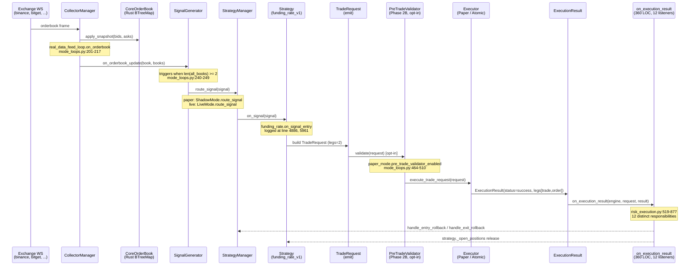

# Communication Flow — Signal → Strategy → Executor → Result

**Audit Date**: 2026-04-26
**Phase**: 5.0 pre-audit
**Evidence**: `/tmp/leviathan_v12.log` (paper canary, 2026-04-26 13:32:36 ~ 14:39:28)
**Scope**: documents the actual end-to-end flow that was observed running in paper mode and contrasts it with the live mode divergence point.

This is a **descriptive** document, not aspirational. Every step has a `file:line` reference and (where available) a paper canary log line proving the step actually fired in production.

---

## 1. End-to-end sequence (paper canary, observed)



### Log evidence — full chain firing in paper canary

| Step | Timestamp | Log line | Source |
|------|-----------|----------|--------|
| Boot | `13:32:36` | `paper_mode.starting` | `engine/src/modes/shadow.py` (called by `mode_loops.paper_mode_loop`, mode_loops.py:551) |
| Boot | `13:32:37` | `paper_mode.started multi_strategy=True` | shadow.py |
| WS subscribe | `13:32:37` | `collector_subscribed exchange=binance symbol=SENT/USDT` | `collectors/manager.py` |
| Strategy entry | `13:32:43` | `funding_rate.on_signal_entry sym=API3/USDT is_active=True` | `strategies/funding_rate.py` |
| Signal routed | `13:32:41+` | `paper_mode.signal_routed requests_generated=N strategy=...` | `modes/shadow.py` (`route_signal`) |
| Trade executed | `13:32:44` | `paper_mode.trade_request_executed elapsed_ms=1028.91 legs=2 net_pnl=+0.6251 result=win strategy_id=funding_rate_v1 total_pnl=+30.9827` | `modes/shadow.py` (after `_paper_executor.execute`) |

The `requests_generated` field on `paper_mode.signal_routed` is critical — it shows the gate that decides whether a Signal converts to a TradeRequest. Most lines show `requests_generated=0` (signal observed but rejected). The `funding_rate_v1` line at 13:32:44 is the rare positive case (`requests_generated=1` → `trade_request_executed` 1 ms later). 30.98 USDT cumulative paper PnL after ~7 seconds confirms the chain is alive end-to-end.

---

## 2. Step-by-step file/line trace

### 2.1 WS → CoreOrderBook

| File:line | Function | Responsibility |
|-----------|----------|----------------|
| `engine/src/runtime/mode_loops.py:185-289` | `real_data_feed_loop` | hosts the WS-to-orderbook bridge for paper+live |
| `engine/src/runtime/mode_loops.py:201-208` | `on_orderbook(exchange_id, symbol, bids, asks)` | converts raw payload to `CoreOrderBook(symbol, exchange)` then `apply_snapshot([(p, q)…])` |
| `engine/src/runtime/mode_loops.py:209` | `all_books[exchange_id] = core_book` | per-exchange last-snapshot cache (NOT a per-symbol cache — there's a known mismatch: `all_books` is keyed by exchange_id only) |
| `engine/src/runtime/mode_loops.py:212-223` | `engine._market_recorder.record_orderbook(...)` | optional TimescaleDB recording |
| `engine/src/runtime/mode_loops.py:226-237` | `engine._triangular_scanner.on_orderbook_update(...)` | US-170 triangular cycle scanning |
| `engine/src/runtime/mode_loops.py:261-266` | `CollectorManager(symbols, exchanges, on_orderbook=on_orderbook).start()` | starts WS subscriptions for all configured exchanges |

Subscribe loop in paper canary writes 7×N lines (one per exchange × symbol) — line 272-1199 of the log are all `collector_subscribed` messages.

### 2.2 SignalGenerator gate (≥2 exchanges required)

| File:line | Function | Responsibility |
|-----------|----------|----------------|
| `engine/src/runtime/mode_loops.py:240-249` | `if engine._signal_generator and len(all_books) >= 2: sig = await engine._signal_generator.on_orderbook_update(book=core_book, books=all_books)` | the **single gate** that prevents firing until 2+ exchanges have data |
| `engine/src/signal/signal_generator.py` | `SignalGenerator.on_orderbook_update` | runs cost calculator + cross-exchange spread check; emits `Signal` if edge after friction |
| `engine/src/runtime/mode_loops.py:246-247` | `await engine._telegram.send_signal_found(sig)` | optional Telegram broadcast on signal emission |
| `engine/src/runtime/pipeline_init.py:*` | `init_signal_pipeline` | wires `SignalGenerator(price_hub, cost_calculator, event_bus, regime_detector, adaptive_threshold, dynamic_sizer)` |

### 2.3 Mode-specific signal routing

This is the divergence point between paper and live. Both call `route_signal(signal)` but on different orchestrator objects.

#### Paper

| File:line | Function | Responsibility |
|-----------|----------|----------------|
| `engine/src/runtime/mode_loops.py:512-532` | `engine._paper_mode = ShadowMode(...)` | constructs ShadowMode with `signal_generator=engine._signal_generator`, `paper_executor=None` (auto-creates `PowerLawSlippage(gamma=0.5)`), `strategy_manager=engine._strategy_manager`, `pre_trade_validator=_shadow_pre_trade_validator` (Phase 2B opt-in), `execution_journal=_shadow_execution_journal` (Phase 2B opt-in) |
| `engine/src/modes/shadow.py` | `ShadowMode.route_signal` | routes signal → strategy.on_signal → emits TradeRequest → calls `_paper_executor.execute` directly (no Redis bus), records to `_stats` |
| `engine/src/runtime/mode_loops.py:548-549` | `engine.context.paper_mode = engine._paper_mode; await engine._paper_mode.start()` | API context handle + lifecycle start |

#### Live

| File:line | Function | Responsibility |
|-----------|----------|----------------|
| `engine/src/runtime/mode_loops.py:343-369` | `engine._live_mode = LiveMode(...)` | LiveMode constructor — note larger surface area: `live_gate`, `risk_guardian`, `kill_switch`, `circuit_breaker`, `min_notional_registry`, `tca_analyzer`, `slippage_feedback_collector` are all wired in |
| `engine/src/modes/live.py` | `LiveMode.start / route_signal / _execute_trade_request / _dedup_cleanup_loop` | direct in-process routing (no Redis consumer); uses `engine._executor` (AtomicExecutor) instead of paper_executor |
| `engine/src/runtime/mode_loops.py:370-374` | `PnLLedger / PnLReconciler / ExchangePnLSnapshot` post-init wiring | live-only Path-B Day-1 reconciliation harness — paper does not initialise these |

### 2.4 Strategy → TradeRequest emission

| File:line | Function | Responsibility |
|-----------|----------|----------------|
| `engine/src/runtime/pipeline_init.py:*` | `init_strategies / register_default_strategies` | registers 6 strategies (cross_exchange_v1, spot_futures_basis, futures_futures, triangular, funding_rate_v1, statistical_arb) |
| `engine/src/strategies/funding_rate.py` | `on_signal` | logs `funding_rate.on_signal_entry sym=… is_active=True` then builds 2-leg TradeRequest |
| `engine/src/core/strategy_manager.py` | `route_signal` | per-strategy dispatch; iterates all `is_active=True` strategies that subscribe to the signal type |
| `engine/src/strategies/base.py` | `pop_exit_requests` | exit-side TradeRequest production (settlement / timeout closes) — drained by `strategy_exit_poll_loop` (background_loops.py:501-545) every 60s |

### 2.5 PreTradeValidator (Phase 2B, opt-in via `EXECUTION_PRETRADE_VALIDATOR_ENABLED`)

| File:line | Function | Responsibility |
|-----------|----------|----------------|
| `engine/src/runtime/mode_loops.py:464-510` | construction block | builds PreTradeValidator with kill_switch, dedup gate, flash_guard, **risk_guardian=None for paper** (note: paper uses self-contained risk; live uses real RiskGuardian), session loss supplier, halt_local |
| `engine/src/execution/pre_trade_validator.py` | `PreTradeValidator.validate` | gate sequence: kill_switch → flash_guard → strategy_filter → dedup → cooldown → min_notional → margin → session loss |
| `engine/src/execution/dedup.py` | `DeduplicationGate(window_s=10.0)` | dedup of identical strategy+symbol within 10s window |

### 2.6 Executor → ExecutionResult

| File:line | Function | Responsibility |
|-----------|----------|----------------|
| `engine/src/runtime/risk_execution.py:251-253` | `engine._executor = AtomicExecutor(exchanges=engine._exchanges)` | the live mode executor; uses real adapters' `place_order` |
| `engine/src/runtime/risk_execution.py:260-265` | `engine._trade_consumer = TradeRequestConsumer(event_bus, executor, risk_check, on_result=engine._on_execution_result)` | Redis-backed consumer for paths that publish to `leviathan:trade_requests` (note: paper bypasses this in v12) |
| `engine/src/execution/executor.py` | `AtomicExecutor.execute_trade_request` | parallel-leg IOC-TTL execution (Day 11), Journal+StateMachine wiring (Day 14) |
| `engine/src/execution/paper.py` | `PaperExecutor.execute` | simulated fills, Decimal slippage from `SlippageModel(base_slippage_pct, volatility_factor)` (with Day 9+ `predicted_slippage_bps` populated from `BookWalkSlippage`) |

### 2.7 Result callback → 12-listener fan-out

`engine/src/runtime/risk_execution.py:519-877` (358 LOC, the function this refactor's `Phase 5.2.4` will decompose).

```python
def on_execution_result(engine: "Engine", trade_request, execution_result) -> None:
    # 12 distinct responsibilities — see listener-decomposition.md for full breakdown
```

Listed in execution order (line numbers within `risk_execution.py`):

| # | Listener (proposed) | Lines | Responsibility |
|---|----------------------|-------|----------------|
| 1 | `LogListener` | 521-525 | header info log |
| 2 | `PositionSizeLeakListener` | 527-548 | `engine._position_sizes` BUY/SELL netting |
| 3 | `PositionManagerListener` | 549-594 | `engine._position_manager` queue dispatch (`_pm_queue`) — async drain via `pm_drain_loop` |
| 4 | `CrossHedgeListener` | 595-627 | `engine._cross_exchange_positions` + `_cross_gross_exposure` for delta-neutral hedges |
| 5 | `PnLPeakListener` | 628-655 | `engine._total_pnl` + `engine._peak_equity` updates |
| 6 | `MarketRecorderListener` | 656-692 | TimescaleDB execution recording via `engine._market_recorder.record_execution` |
| 7 | `ExposureListener` | 694-719 | `engine._exposure_tracker.update_exposure` (Redis-backed) |
| 8 | `SlippageListener` | 721-732 | `engine._slippage_feedback.record_fill` (US-115) |
| 9 | `CorrelationListener` | 733-739 | `engine._correlation_monitor.record_trade_pnl` (US-118) |
| 10 | `TCAListener` | 740-777 | `engine._tca_analyzer.record_execution` (US-116, US-329 timing decomp) |
| 11 | `TradeHistoryListener` | 778-797 | `engine.context.trade_history.append` (dashboard API surface) |
| 12 | `CircuitBreakerListener` | 799-820 | `engine._circuit_breaker.record_win / record_loss` (US-DW1) |
| 13 | `RollbackListener` | 822-860 | strategy `_open_positions` release + `_position_sizes` rollback leak fix (WS-3.3) |
| 14 | `TelegramListener` | 862-876 | Korean fill notification via `engine._trade_bot.send_fill_kr` (US-DW8) |

Total = **14 listeners** (the original plan said 12 — Phase 5.2.4 should redo the count; both `LogListener` and `PositionSizeLeakListener` could be merged or hoisted, but as observed today there are 14 distinct responsibilities).

---

## 3. Mode-specific divergence summary

| Concern | Paper canary (observed v12) | Live mode |
|---------|------------------------------|-----------|
| Orchestrator | `ShadowMode` (paper_mode_loop) | `LiveMode` (live_mode_loop) |
| Executor | `PaperExecutor(PowerLawSlippage gamma=0.5)`, k=0 in PaperExecutor | `AtomicExecutor(exchanges)` |
| Risk gate | `risk_guardian=None` injected (paper has self-contained loss cap + portfolio_risk + flash_guard) | `RiskGuardian` 9-check via `build_risk_check_fn` in `TradeRequestConsumer` and `LiveMode._execute_trade_request` |
| Signal routing | `ShadowMode.route_signal` direct in-process | `LiveMode.route_signal` direct in-process (BUG-73: NOT via Redis) |
| Path-B reconciler | not initialised | `PnLLedger` + `PnLReconciler` + `ExchangePnLSnapshot` (mode_loops.py:370-374) |
| min_notional gate | `_PaperMinNotionalStub` returning 0.0 | `MinNotionalRegistry(engine._exchanges)` (mode_loops.py:340-341) |
| Settlement collector | `FundingRateCollector.fetch_paired_symbols` | same |
| ExecutionJournal | opt-in `EXECUTION_JOURNAL_ENABLED` flag (mode_loops.py:450-463) | always-on |
| Pre-trade gates | `PreTradeValidator` injected when `EXECUTION_PRETRADE_VALIDATOR_ENABLED` (mode_loops.py:464-510) | always-on |
| Dedup window | shared `DeduplicationGate(window_s=10.0)` | shared, plus `LiveMode._dedup_cleanup_loop` |

The two modes already share the same `SignalGenerator + StrategyManager + Strategy` chain. The divergence sits below `route_signal` in the orchestrator, executor, and post-trade callbacks — exactly the surface Phase 5.4 (`ModeRunner` ABC) and Phase 5.1 (`ExecutorPort`, `RiskPort`) are meant to unify.

---

## 4. Industry pattern alignment

| Pattern | Where it lives in LEVIATHAN today | What `Phase 5` will tighten |
|---------|------------------------------------|------------------------------|
| Nautilus `MessageBus` (events as first-class) | We use `EventBus` for `leviathan:trade_requests` Redis topic, **but** paper bypasses it (BUG-73 root). Live also bypasses (`LiveMode._execute_trade_request` direct call). | Phase 5.1 `ExecutorPort` + `JournalPort` + Phase 5.4 `ModeRunner` each act as message-bus seams. Listener decomposition makes the on_execution_result fanout a proper observer pattern. |
| Hummingbot `OrderFilledEvent`/`BuyOrderCompletedEvent` lifecycle | We have `ExecutionResult.status ∈ {success, rolled_back, rollback_failed, rejected, timeout}` but no separate FILLED → COMPLETED → CANCELLED state machine — `OrderStateMachine` (Day 7) addresses this for the executor; the strategy still sees only `on_execution_result`. | Phase 5.1 `ExecutorPort` should expose lifecycle events as discrete signals, not a single fat result struct. |
| LEAN `AlgorithmManager.Run` per-timeslice loop with `OnData → OnEndOfTimeStep → ProcessVolatility` | Our paper/live mode loops are equivalent to a **per-orderbook-frame** run, but they directly call `engine._signal_generator.on_orderbook_update` rather than going through a manager that fans out to multiple sinks (recorder, scanner, generator) | Phase 5.4 `ModeRunner.tick()` introduces the LEAN-style synchronization point. |
| LEAN `IBrokerage` swap | Our `PaperExchangeAdapter` and native adapters share an implicit Protocol. Phase 5.1 makes it explicit. | Phase 5.1 `ExchangeAdapterPort` Protocol — once defined, paper vs live becomes a Port implementation choice instead of a mode_loops if-elif. |

---

## 5. Open questions surfaced during audit

1. **`all_books` keyed by exchange_id only** (mode_loops.py:209). Multiple symbols overwrite each other — the SignalGenerator only sees the **last symbol per exchange**. This is a latent bug, not a refactor target, but Phase 5.1 `DataFeedPort` can lift the cache structure.
2. **Paper bypasses Redis bus**, live bypasses Redis bus too (BUG-73). The Redis `leviathan:trade_requests` topic and `TradeRequestConsumer` exist but are unused on the hot path. Phase 5.1 `ExecutorPort` should formalise whether bus-mediated dispatch is still a supported topology, or if the Redis path is dead and should be removed.
3. **PreTradeValidator with `risk_guardian=None`** in paper (mode_loops.py:491) means paper does **not** exercise the full 9-check sequence the way live does. Any Phase 5 refactor that "shares the validator" must keep this asymmetry visible — Phase 5.1 `RiskPort` mock for paper is the cleaner answer.
4. **`requests_generated` field semantics** (paper_mode.signal_routed). It is the single observable proving downstream emission. Phase 5.1 `JournalPort` should cover `signal_observed` / `signal_dropped` events so this field is replaced with structured journal entries instead of an ad-hoc log token.
