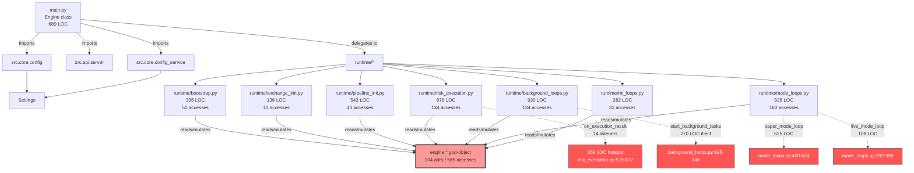

# Module Dependency Map — engine/src/runtime/* + main.py

**Audit Date**: 2026-04-26
**Phase**: 5.0 pre-audit
**Counting basis**: ripgrep over `engine/src/runtime/*.py` for `engine._\w+` accesses + `from src.*` import edges. Lines counted with `wc -l`.

This document maps the **god-object pull** that Phase 5 must dissolve. The `engine: "Engine"` first-arg pattern is documented quantitatively (per-module attribute access count, top-30 attributes globally, import edges) so the Phase 5.2 migration sequence can be picked rationally.

---

## 1. Module size + accesses summary

| Module | LOC | `engine.*` access count | LOC budget violation? | Phase 5 target |
|--------|-----|--------------------------|------------------------|-----------------|
| `runtime/__init__.py` | 14 | 0 | no | n/a |
| `runtime/exchange_init.py` | 136 | 13 | no (well under 400) | Phase 5.2: ExchangeAdapterPort DI |
| `runtime/ml_loops.py` | 282 | 31 | no | Phase 5.2: ML port (later, lower risk) |
| `runtime/bootstrap.py` | 395 | 50 | borderline (97% of 400) | Phase 5.2: configservice + DI container |
| `runtime/pipeline_init.py` | 543 | 43 | **YES (>400)** | Phase 5.2: SignalGenerator factory (pipeline split) |
| `runtime/mode_loops.py` | 826 | 160 | **YES (>>400)** | Phase 5.4: `ModeRunner` ABC |
| `runtime/risk_execution.py` | 878 | 134 | **YES (>>400)** | Phase 5.2.4: 14-listener decomposition |
| `runtime/background_loops.py` | 930 | 134 | **YES (>>400)** | Phase 5.3: `LifecycleManager` |
| `src/main.py` | 689 | n/a (defines `engine`) | violator (above LOC budget for an entry point) | Phase 5.5 size hook |
| **Total** | **4,693** | **565** | 4 violators | |

(This contradicts §1.1 of the original Phase 5 plan, which said 4,679 — the delta is the ml_loops module being slightly larger today. Numbers above are recomputed from current HEAD.)

---

## 2. Top-30 most-accessed god-object attributes

The `engine: "Engine"` god-object exposes 104 distinct mutable attributes. The 30 most-pulled across `runtime/*.py`:

| Rank | Attribute | Accesses | Logical group | Phase 5.1 Port mapping |
|------|-----------|----------|---------------|------------------------|
| 1 | `_settings` | 47 | immutable config | passes as `Settings` arg, no Port needed |
| 2 | `_telegram` | 38 | optional sink | `TelegramPort` (or `NotificationPort`) |
| 3 | `_db_pool` | 36 | infra | `DatabasePort` |
| 4 | `_exchanges` | 33 | adapter map | `ExchangeAdapterPort` (one per id) |
| 5 | `_strategy_manager` | 33 | runtime | `StrategyManagerPort` |
| 6 | `_regime_detector` | 24 | ML | `MLRegimePort` |
| 7 | `_signal_generator` | 22 | runtime | `SignalGeneratorPort` |
| 8 | `_paper_mode` | 21 | mode | absorbed by `ModeRunner` |
| 9 | `_redis_client` | 16 | infra | `EventBusPort` / `KVStorePort` |
| 10 | `_risk_guardian` | 16 | risk | `RiskPort` |
| 11 | `_data_quality_manager` | 16 | infra | `DataQualityPort` |
| 12 | `_peak_equity` | 14 | **mutable state** | EngineState |
| 13 | `_engine_mode` | 13 | immutable config | passed to ModeRunner |
| 14 | `_event_bus` | 13 | infra | `EventBusPort` |
| 15 | `_position_sizes` | 12 | **mutable state** | EngineState |
| 16 | `_market_recorder` | 11 | sink | `MarketRecorderPort` |
| 17 | `_trade_bot` | 11 | optional sink | `TelegramPort` |
| 18 | `_position_manager` | 11 | runtime | `PositionManagerPort` |
| 19 | `_rebalancer` | 11 | optional | `RebalancerPort` (or feature module) |
| 20 | `_circuit_breaker` | 10 | risk | `RiskPort` |
| 21 | `_live_mode` | 9 | mode | absorbed by `ModeRunner` |
| 22 | `_flash_guard` | 9 | risk | `RiskPort` |
| 23 | `_adaptive_threshold` | 9 | ML | `MLRegimePort` |
| 24 | `_active_exchanges` | 8 | immutable config | EngineSettings |
| 25 | `_live_gate` | 8 | mode | `LiveGatePort` |
| 26 | `_portfolio_risk` | 7 | risk | `RiskPort` |
| 27 | `_collector_manager` | 7 | infra | `DataFeedPort` |
| 28 | `_exposure_tracker` | 6 | risk | `RiskPort` |
| 29 | `_total_pnl` | 6 | **mutable state** | EngineState |
| 30 | `_shutdown_event` | 5 | lifecycle | `LifecycleManager` |

**Mutable state** (rows 12, 15, 29 + 8 more — see `engine-state-design.md`) is what makes the god-object dangerous: any caller can mutate `_total_pnl` from anywhere. Phase 5.2.1 quarantines those into `EngineState`.

---

## 3. Per-module accesses

### 3.1 `runtime/bootstrap.py` (50 accesses)

Reads `_settings`, `_db_pool`, `_telegram`, `_event_bus`, `_redis_client`, `_collector_manager`, `_active_exchanges`, `_engine_mode`, `_scheduled_tuner`, `_http_client`. **Mutates** all of those (it is the wiring stage).

Phase 5.2 strategy: `ConfigService.load() → Settings`, then `bootstrap_infrastructure(settings) → InfrastructureBundle` returns a frozen tuple. Engine just stores the bundle.

### 3.2 `runtime/exchange_init.py` (13 accesses)

Smallest pull. Mutates `_exchanges` (the dict), reads `_settings.capital`. Easy first port — use it as Phase 5.2 pilot.

### 3.3 `runtime/pipeline_init.py` (43 accesses)

Constructs `_price_hub`, `_cost_calculator`, `_cost_feedback`, `_signal_generator`, `_strategy_manager`, `_regime_detector`, `_adaptive_threshold`, `_triangular_scanner`, `_slippage_fb_collector`, `_dynamic_sizer`. Reads `_event_bus`, `_settings`, `_active_exchanges`, `_load_strategy_params()`.

Phase 5.2 strategy: explicit `SignalPipelineFactory.build(settings, event_bus, regime_port, ml_port) → SignalPipeline` returns `(price_hub, cost_calculator, signal_generator, strategy_manager)` tuple.

### 3.4 `runtime/risk_execution.py` (134 accesses)

Constructs `_circuit_breaker`, `_risk_guardian`, `_per_strategy_cb`, `_correlation_monitor`, `_data_quality_manager`, `_flash_guard`, `_exposure_tracker`, `_position_manager`, `_pm_queue`, `_pm_drain_task`, `_pm_drain_errors`, `_executor`, `_trade_consumer`, `_slippage_feedback`, `_dynamic_sizer`, `_tca_analyzer`, `_balance_tracker`, `_rebalancer`, `_position_recovery`, `_recovery_manager`, `_position_reconciler`. Reads `_settings`, `_exchanges`, `_db_pool`, `_redis_client`, `_telegram`, `_signal_generator`, `_portfolio_risk`.

`on_execution_result` alone is the biggest hotspot — it reads/writes 14 attributes (see listener-decomposition.md).

### 3.5 `runtime/background_loops.py` (134 accesses)

Reads everything to build `tasks = [asyncio.create_task(...)]`. Calls `engine._{health_check,reconcile,heartbeat,...}_loop` thin wrappers.

Phase 5.3 strategy: replace `tasks = [...]` block with `LifecycleManager.start_all()` register/depends_on graph. Each loop becomes a registered service with explicit dependencies.

### 3.6 `runtime/mode_loops.py` (160 accesses — largest)

Constructs mode orchestrators: `_paper_mode = ShadowMode(...)`, `_live_mode = LiveMode(...)`, `_collector_manager`, `_multi_signal_producer`, `_kill_switch`, `_pnl_ledger`, `_pnl_reconciler`, `_pnl_snapshot`, `_min_notional_registry`, `_live_gate`. Heavy `engine._*` pull because each mode wires ~30+ dependencies into the orchestrator constructor.

Phase 5.4 strategy: `ModeRunnerFactory.build(mode, deps) → BacktestRunner | PaperRunner | LiveRunner`.

### 3.7 `runtime/ml_loops.py` (31 accesses)

Reads `_regime_detector`, `_adaptive_threshold`, `_paper_mode._stats`, `_signal_generator._config`, `_db_pool`, `_total_pnl`. Mutates `_regime_pnl_history`, `_regime_last_pnl`, `_signal_generator._config.min_edge`.

Phase 5.2 strategy: `MLRegimePort` + reads-only access to engine state via injected getter.

---

## 4. Module dependency graph

**Red boxes are the four hot spots** Phase 5 must crack:
1. `risk_execution.on_execution_result` (Phase 5.2.4 listener decomp)
2. `mode_loops.paper_mode_loop` + `live_mode_loop` (Phase 5.4 ModeRunner)
3. `background_loops.start_background_tasks` (Phase 5.3 LifecycleManager)
4. `engine.* god-object` (cross-cutting Phase 5.1 + 5.2)

---

## 5. Import edges

External imports per runtime module (from rg `^from src` or `^import src`):

| Module | `from src.core.config` | other top-level src imports |
|--------|-------------------------|------------------------------|
| `bootstrap.py` | `Settings, get_settings` | (intra-function lazy imports for `dotenv`, `aiohttp`, `Telegram`, `RustBridge`, `ScheduledTuner`) |
| `exchange_init.py` | (none top-level — all lazy) | (intra-function: `PaperExchangeAdapter`, native adapter modules, `LiveAdapter`) |
| `pipeline_init.py` | `Settings, get_settings` | (intra-function: `PriceHub`, `CostCalculator`, `SignalGenerator`, `StrategyManager`, regime / adaptive_threshold / triangular_scanner / dynamic_sizer / multi_signal) |
| `risk_execution.py` | (lazy imports inside functions) | (every function lazy-imports its deps to break circular import w/ main.py) |
| `background_loops.py` | `EngineMode, Settings, get_settings` | (lazy: PositionRecovery, ComplianceChecker, KillSwitch, etc.) |
| `mode_loops.py` | `Settings, get_settings` + `config_loader.get_bool_flag` | (lazy: ShadowMode, PaperMode, LiveMode, BacktestMode, WalkForwardAnalyzer, MultiStrategySignalProducer, FundingRateCollector, MinNotionalRegistry, LiveGate, KillSwitch, PnLLedger, PnLReconciler, ExchangePnLSnapshot, RustBridge) |
| `ml_loops.py` | `get_settings` | (lazy: HMMRegimeDetector, RegimeDetector, OnnxRuntimeInfer) |

Pattern: every `runtime/*` module avoids top-level imports beyond `src.core.config`. **All deeper imports are lazy inside functions** — done deliberately in Phase 4 to break the circular import created by `from src.main import Engine` in `TYPE_CHECKING`. This is fragile but works today.

Phase 5 fix: passing concrete Port objects as parameters removes the `from src.main import Engine` need entirely. Lazy imports stay (they are also a cold-start performance technique), but the circular dependency disappears.

---

## 6. Hot spot risk ranking

| Rank | Hot spot | Risk | Why |
|------|----------|------|-----|
| 1 | `mode_loops.paper_mode_loop` (625 LOC, 160 accesses across module) | **HIGH** | paper canary is the active production validator; any change here risks breaking the v12 48H gate |
| 2 | `risk_execution.on_execution_result` (358 LOC, 14 listeners) | **HIGH** | runs after every fill — any silent regression corrupts PnL/peak/CB feedback |
| 3 | `background_loops.start_background_tasks` (151 LOC if-elif) | MED | restart-time only; failures are loud (logs which task) |
| 4 | `mode_loops.live_mode_loop` (108 LOC) | MED | smaller surface but invokes the actual broker — needs careful Port abstraction |
| 5 | `bootstrap.py` (395 LOC) | LOW | runs once at boot; failures are loud |
| 6 | `pipeline_init.py` (543 LOC) | LOW | pure constructor wiring; failures are loud |
| 7 | `exchange_init.py` (136 LOC, 13 accesses) | LOW | small + isolated → **best Phase 5.2 pilot** |
| 8 | `ml_loops.py` (282 LOC, 31 accesses) | LOW | training loops are non-critical; can degrade gracefully |

Recommended Phase 5 sequence:
1. **Phase 5.1** (LOW risk, 2-3d): define all 7 ports — no code changes elsewhere.
2. **Phase 5.2.0**: `EngineState` dataclass extraction (data-only, no logic move). Mutable attrs go behind `engine.state.X` accessors.
3. **Phase 5.2.1**: pilot port migration on `exchange_init.py` (smallest blast radius).
4. **Phase 5.2.2**: pilot listener decomposition with one listener (`PositionSizeLeakListener`) to validate the pattern.
5. **Phase 5.2.3**: full 14-listener decomp (sequenced — see listener-decomposition.md §3).
6. **Phase 5.3**: LifecycleManager replaces `start_background_tasks`.
7. **Phase 5.4**: `ModeRunner` ABC absorbs `mode_loops.py` if-elif.
8. **Phase 5.5**: pre-commit LOC budget hook — by this point, all violators are gone.
