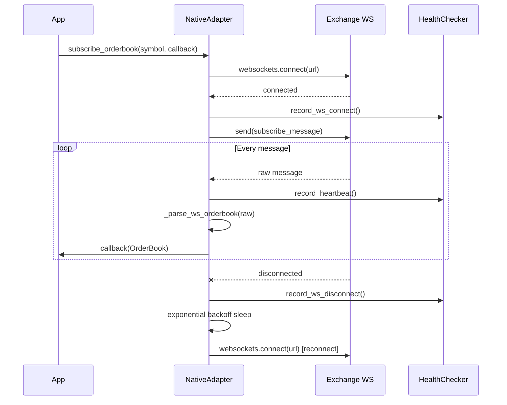

# Native Adapter API Contract

**LEVIATHAN Arbitrage Engine — Phase 4: Native Exchange Adapters**

Version: 1.0.0
Date: 2026-03-07
Status: Authoritative reference for all native exchange adapter implementations

---

## Table of Contents

1. [Architecture Overview](#1-architecture-overview)
2. [Protocol Interface](#2-protocol-interface)
3. [Per-Exchange Specifications](#3-per-exchange-specifications)
4. [Rate Limiting](#4-rate-limiting)
5. [Health Scoring](#5-health-scoring)
6. [WebSocket Reconnection](#6-websocket-reconnection)
7. [Signing Methods](#7-signing-methods)
8. [Latency Targets](#8-latency-targets)
9. [Error Handling Contract](#9-error-handling-contract)
10. [Implementation Checklist](#10-implementation-checklist)

---

## 1. Architecture Overview

### Why Native Adapters

The native adapters replace `ccxt` entirely. The motivations are:

- **Latency**: ccxt adds serialization overhead on every call. Direct `httpx` + `websockets` eliminates the abstraction layer.
- **Control**: Custom signing, custom reconnect logic, custom rate limiting tuned per exchange.
- **Dependency**: Removing ccxt removes ~180 transitive dependencies and the risk of upstream breaking changes.
- **Correctness**: ccxt normalizes data in ways that obscure exchange-specific fields (sequence numbers, checksums, fee structures).

### Class Hierarchy

```
NativeAdapter (abstract base)
├── BinanceNativeAdapter       (HMAC-SHA256, query-param signature)
├── NativeBybitAdapter         (HMAC-SHA256, header-based signature)
├── NativeOKXAdapter           (HMAC-SHA256, base64, ISO timestamp)
├── NativeBitgetAdapter        (HMAC-SHA256, base64, passphrase)
├── NativeUpbitAdapter         (JWT HS256, no passphrase)
└── NativeBithumbAdapter       (HMAC-SHA512, form-encoded POST)
```

### Dependency Stack

```
NativeAdapter
  ├── httpx.AsyncClient          REST with connection pooling (max 20 connections)
  ├── websockets                 WS with auto-reconnect
  ├── ExchangeRateLimiter        TokenBucket per endpoint category
  └── HealthChecker              Composite health score (0.0 – 1.0)
```

### Data Flow (WebSocket orderbook)



---

## 2. Protocol Interface

All adapters implement the `NativeAdapter` abstract base. The class is structurally compatible with the `ExchangeAdapter` protocol used throughout the engine — no explicit `Protocol` inheritance is required.

### 2.1 Constructor

```python
NativeAdapter(
    exchange_id: str,
    api_key: str = "",
    api_secret: str = "",
    passphrase: str = "",        # OKX, Bitget only
    sandbox: bool = False,
    rate_limits: dict[str, RateLimitConfig] | None = None,
    stale_threshold_seconds: float = 5.0,
)
```

| Parameter | Type | Default | Description |
|---|---|---|---|
| `exchange_id` | `str` | required | Unique exchange identifier (e.g. `"binance"`) |
| `api_key` | `str` | `""` | REST/WS API key |
| `api_secret` | `str` | `""` | Secret for HMAC or JWT signing |
| `passphrase` | `str` | `""` | OKX and Bitget require a passphrase in addition to key/secret |
| `sandbox` | `bool` | `False` | Use testnet/sandbox URLs when `True` |
| `rate_limits` | `dict \| None` | `None` | Override default rate limits; falls back to `DEFAULT_RATE_LIMITS[exchange_id]` |
| `stale_threshold_seconds` | `float` | `5.0` | Seconds without a WS heartbeat before health score begins decaying |

### 2.2 Connection Lifecycle

#### `connect() -> None`

Initializes the `httpx.AsyncClient` with connection pooling and marks the adapter as connected.

```python
self._http = httpx.AsyncClient(
    base_url=self._rest_base_url(),
    timeout=httpx.Timeout(10.0, connect=5.0),
    limits=httpx.Limits(max_connections=20, max_keepalive_connections=10),
    headers=self._default_headers(),
)
```

**Side effects:**
- `HealthChecker.record_ws_connect()` is called
- `self._connected = True`

**Must be called before any REST or WS operations.**

---

#### `disconnect() -> None`

Cancels all active WebSocket subscription tasks and closes the HTTP client.

**Side effects:**
- All tasks in `self._ws_tasks` are cancelled and cleared
- `self._http.aclose()` is awaited
- `HealthChecker.record_ws_disconnect()` is called
- `self._connected = False`

**Does not raise.** Safe to call even if not connected.

---

### 2.3 WebSocket Subscriptions

#### `subscribe_orderbook(symbol: str, callback: Callable[[OrderBook], None]) -> None`

Subscribe to live Level 2 orderbook updates. **Idempotent** — calling again with the same symbol is a no-op (the existing task continues).

| Parameter | Type | Description |
|---|---|---|
| `symbol` | `str` | Normalized symbol in `"BASE/QUOTE"` format (e.g. `"BTC/USDT"`) |
| `callback` | `Callable[[OrderBook], None]` | Called synchronously on every parsed orderbook message |

**Behavior:**
- Creates an `asyncio.Task` stored under key `"orderbook:{symbol}"`
- The task runs `_watch_loop()` which auto-reconnects on any non-`CancelledError` exception
- `callback` is invoked only when `_parse_ws_orderbook()` returns a non-`None` `OrderBook`
- Each message triggers `HealthChecker.record_heartbeat()`

**Returns:** `None`. The subscription is fire-and-forget; errors are logged as warnings.

---

#### `subscribe_ticker(symbol: str, callback: Callable) -> None`

Subscribe to live ticker updates. Idempotent; stored under key `"ticker:{symbol}"`.

Same reconnect and callback semantics as `subscribe_orderbook`. The ticker callback receives whatever `_parse_ws_ticker()` returns (exchange-specific dict or None).

---

### 2.4 REST API Methods

All REST methods acquire a rate-limit token before executing and record metrics to `HealthChecker`.

#### `get_orderbook_snapshot(symbol: str, depth: int = 20) -> OrderBook`

Fetch a point-in-time Level 2 orderbook via REST.

| Parameter | Default | Notes |
|---|---|---|
| `symbol` | required | `"BASE/QUOTE"` format |
| `depth` | `20` | Number of levels per side; exchange maximum varies |

**Rate limit bucket:** `"default"`

**Returns:** `OrderBook` with `exchange_id`, `symbol`, `bids`, `asks`, and optional `sequence`.

**Raises:** Any `httpx` or exchange exception. `HealthChecker.record_error()` is called before re-raising. API latency is recorded via `HealthChecker.record_api_latency()`.

---

#### `place_order(order: Order) -> Trade`

Submit an order to the exchange.

```python
@dataclass
class Order:
    symbol: str               # "BTC/USDT"
    side: OrderSide           # OrderSide.BUY | OrderSide.SELL
    order_type: OrderType     # OrderType.LIMIT | OrderType.MARKET
    amount: Decimal           # Base asset quantity
    price: Decimal | None     # Required for LIMIT orders
    order_id: str | None      # Exchange order ID (usually None on submission)
    client_order_id: str | None  # Optional client-assigned ID
```

**Rate limit bucket:** `"order"`

**Returns:** `Trade` with fill details (price, amount, fee, fee_currency).

**Raises:** Any exception from the underlying REST call. Both `HealthChecker.record_error()` and `HealthChecker.record_order_fill(False)` are called before re-raising. On success, `HealthChecker.record_order_fill(True)` is called.

**Note on fill price:** Several exchanges (Bybit, Bitget, Upbit, Bithumb) return `order.price` as the fill price because their order-create responses do not include execution price. The true fill price is only available via a separate trades/fills query.

---

#### `cancel_order(order_id: str, symbol: str | None = None) -> bool`

Cancel a single open order.

| Parameter | Required? | Notes |
|---|---|---|
| `order_id` | Yes | Exchange-assigned order ID |
| `symbol` | Conditional | Required for Binance; optional for others |

**Rate limit bucket:** `"order"`

**Returns:** `True` if cancelled, `False` if the cancellation failed (does NOT re-raise). This allows callers to treat a failed cancel as a soft failure in kill-switch scenarios.

---

#### `cancel_all_orders(symbol: str | None = None) -> int`

Cancel all open orders, optionally filtered by symbol.

| Exchange | Bulk Cancel Support |
|---|---|
| Binance | Yes — `DELETE /api/v3/openOrders` |
| Bybit | Yes — `POST /v5/order/cancel-all` |
| OKX | Yes — `POST /api/v5/trade/cancel-batch-orders` (fetch then batch) |
| Bitget | Yes — `POST /api/v2/spot/trade/cancel-batch-orders` |
| Upbit | **No** — returns `0` immediately |
| Bithumb | **No** — returns `0` immediately |

**Rate limit bucket:** `"order"`

**Returns:** Count of successfully cancelled orders.

**Raises:** On Binance, `symbol` is required — raises `ValueError` if omitted.

---

#### `get_balances() -> dict[str, Balance]`

Fetch account balances for all assets with non-zero total.

```python
@dataclass
class Balance:
    currency: str      # Asset ticker (e.g. "BTC", "USDT", "KRW")
    free: Decimal      # Available for new orders
    used: Decimal      # Locked in open orders
    total: Decimal     # free + used
```

**Rate limit bucket:** `"default"`

**Returns:** Dict keyed by asset ticker. Only assets with `total > 0` are included (Binance) or all returned assets (other exchanges).

**Raises:** Any exception. `HealthChecker.record_error()` is called before re-raising.

---

#### `get_positions() -> list[Position]`

Fetch open futures/perpetual positions. Spot-only adapters return `[]` without making a network call.

```python
@dataclass
class Position:
    exchange_id: str
    symbol: str
    size: Decimal           # Positive = long, negative = short
    entry_price: Decimal
    mark_price: Decimal
    unrealized_pnl: Decimal
    leverage: int
```

| Exchange | Implementation |
|---|---|
| Binance (futures) | `GET /fapi/v2/positionRisk` — non-zero size only |
| Binance (spot) | Returns `[]` |
| Bybit | Returns `[]` (spot only in current implementation) |
| OKX | Returns `[]` |
| Bitget | Returns `[]` |
| Upbit | Returns `[]` |
| Bithumb | Returns `[]` |

**Rate limit bucket:** `"default"`

**Returns:** `[]` on error (does not raise).

---

#### `get_fee_rate(symbol: str) -> FeeRate`

Fetch maker/taker fee rates for a symbol.

```python
@dataclass
class FeeRate:
    maker: Decimal      # Maker fee as a fraction (e.g. 0.001 = 0.1%)
    taker: Decimal      # Taker fee as a fraction
    symbol: str
    exchange_id: str
```

**Rate limit bucket:** `"default"`

**Returns:** `FeeRate` — never raises. On error, returns exchange-specific defaults (see table below).

| Exchange | Default Maker | Default Taker | Endpoint |
|---|---|---|---|
| Binance | 0.0010 (10 bps) | 0.0010 | `GET /api/v3/account` (`makerCommission` field, basis points) |
| Bybit | 0.0010 | 0.0010 | `GET /v5/account/fee-rate` |
| OKX | 0.0008 | 0.0010 | `GET /api/v5/account/trade-fee` (negative values = rebate, stripped) |
| Bitget | 0.0010 | 0.0010 | Hardcoded default (no endpoint) |
| Upbit | 0.0005 | 0.0005 | Hardcoded default (no endpoint) |
| Bithumb | 0.0025 | 0.0025 | Hardcoded default (no endpoint) |

---

#### `health_score -> float` (property)

Returns the current composite health score in range `[0.0, 1.0]`. Delegates to `HealthChecker.health_score`.

**Minimum score for trading: 0.95** (enforced by the engine's live gate).

---

## 3. Per-Exchange Specifications

### 3.1 Binance

| Property | Production | Sandbox |
|---|---|---|
| REST base URL | `https://api.binance.com` | `https://testnet.binance.vision` |
| WS URL | `wss://stream.binance.com:9443/ws/{stream}` | `wss://testnet.binance.vision/ws/{stream}` |
| Auth method | HMAC-SHA256 (query-param) | Same |
| Passphrase required | No | No |

**Symbol format:** `BTC/USDT` → `BTCUSDT` (slash removed, uppercased)

**Authentication (REST):**
Binance does not use auth headers. Instead, `timestamp` + `recvWindow` + `signature` are appended as query parameters:
```python
params["timestamp"] = int(time.time() * 1000)
params["recvWindow"] = 5000
query_str = urllib.parse.urlencode(sorted(params.items()))
params["signature"] = hmac.new(secret.encode(), query_str.encode(), sha256).hexdigest()
```
The API key is sent via the `X-MBX-APIKEY` header on all requests.

**WebSocket stream URL (no subscribe frame needed):**
```
wss://stream.binance.com:9443/ws/btcusdt@depth20@100ms
```
The stream name encodes the subscription. No subscribe message is sent after connect.

**WebSocket message format:**
```json
{
  "lastUpdateId": 160,
  "bids": [["0.0024", "10"]],
  "asks": [["0.0026", "100"]]
}
```
Combined-stream wrapper (when applicable):
```json
{
  "stream": "btcusdt@depth20@100ms",
  "data": { "lastUpdateId": 160, "bids": [...], "asks": [...] }
}
```

**Orderbook checksum:** The REST snapshot includes a `checksum` field. The adapter validates it using CRC32 over the top-100 levels formatted as `price:amount:price:amount:...`.

**Rate limits (from `DEFAULT_RATE_LIMITS`):**

| Bucket | req/s | Burst |
|---|---|---|
| `default` | 10 | 20 |
| `order` | 5 | 10 |

**Key REST endpoints used:**

| Method | Path | Purpose |
|---|---|---|
| GET | `/api/v3/depth` | Orderbook snapshot |
| POST | `/api/v3/order` | Place order |
| DELETE | `/api/v3/order` | Cancel order (requires `symbol`) |
| DELETE | `/api/v3/openOrders` | Cancel all (requires `symbol`) |
| GET | `/api/v3/account` | Balances + fee rates |
| GET | `/fapi/v2/positionRisk` | Futures positions |

**Connection parameters:**
```python
websockets.connect(url, ping_interval=20, ping_timeout=10)
```

---

### 3.2 Bybit

| Property | Production | Sandbox |
|---|---|---|
| REST base URL | `https://api.bybit.com` | `https://api-testnet.bybit.com` |
| WS URL | `wss://stream.bybit.com/v5/public/spot` | (same) |
| Auth method | HMAC-SHA256 (header-based) | Same |
| Passphrase required | No | No |

**Symbol format:** `BTC/USDT` → `BTCUSDT`

**Authentication headers:**
```python
sign_msg = timestamp + api_key + "5000" + param_string
# param_string: URL-encoded query for GET, JSON body for POST
signature = hmac.new(secret.encode(), sign_msg.encode(), sha256).hexdigest()

headers = {
    "X-BAPI-API-KEY":      api_key,
    "X-BAPI-TIMESTAMP":    timestamp_ms_str,
    "X-BAPI-SIGN":         signature,
    "X-BAPI-RECV-WINDOW":  "5000",
}
```

**WebSocket subscribe message:**
```json
{
  "op": "subscribe",
  "args": ["orderbook.50.BTCUSDT"]
}
```

**WebSocket message format:**
```json
{
  "topic": "orderbook.50.BTCUSDT",
  "data": {
    "b": [["29500.00", "0.5"]],
    "a": [["29501.00", "1.2"]],
    "seq": 123456789
  }
}
```
Fields `b` (bids) and `a` (asks) use `[price, size]` arrays. `seq` is the sequence number.

**Rate limits (from `DEFAULT_RATE_LIMITS`):**

| Bucket | req/s | Burst |
|---|---|---|
| `default` | 5 | 10 |
| `order` | 5 | 10 |

**Key REST endpoints used:**

| Method | Path | Purpose |
|---|---|---|
| GET | `/v5/market/orderbook` | Orderbook snapshot (`category=spot`) |
| POST | `/v5/order/create` | Place order |
| POST | `/v5/order/cancel` | Cancel order |
| POST | `/v5/order/cancel-all` | Cancel all |
| GET | `/v5/account/wallet-balance` | Balances (`accountType=UNIFIED`) |
| GET | `/v5/account/fee-rate` | Fee rates |

**Positions:** Not implemented (spot only). Returns `[]`.

---

### 3.3 OKX

| Property | Production | Sandbox |
|---|---|---|
| REST base URL | `https://www.okx.com` | `https://www.okx.com` (same URL) |
| WS URL | `wss://ws.okx.com:8443/ws/v5/public` | (same URL) |
| Sandbox activation | N/A | `x-simulated-trading: 1` header |
| Auth method | HMAC-SHA256 + base64 + ISO timestamp | Same |
| Passphrase required | **Yes** | Yes |

**Symbol format:** `BTC/USDT` → `BTC-USDT` (slash → dash)

**Authentication headers:**
```python
timestamp = datetime.now(utc).strftime("%Y-%m-%dT%H:%M:%S.%f")[:-3] + "Z"
# e.g. "2026-03-07T12:34:56.789Z"

# For GET: prehash = timestamp + "GET" + "/api/v5/account/balance?ccy=BTC" + ""
# For POST: prehash = timestamp + "POST" + "/api/v5/trade/order" + json_body_string

signature = base64.b64encode(
    hmac.new(secret.encode(), prehash.encode(), sha256).digest()
).decode()

headers = {
    "OK-ACCESS-KEY":        api_key,
    "OK-ACCESS-SIGN":       signature,
    "OK-ACCESS-TIMESTAMP":  timestamp,
    "OK-ACCESS-PASSPHRASE": passphrase,
    # + "x-simulated-trading": "1" if sandbox
}
```

**Important OKX signing note:** For GET requests, the full path including `?query_string` is included in the prehash. For POST requests, the raw JSON body string is included.

**WebSocket subscribe message:**
```json
{
  "op": "subscribe",
  "args": [{"channel": "books", "instId": "BTC-USDT"}]
}
```

**WebSocket message format:**
```json
{
  "arg": {"channel": "books", "instId": "BTC-USDT"},
  "action": "snapshot",
  "data": [{
    "bids": [["29500.00", "0.5", "0", "1"]],
    "asks": [["29501.00", "1.2", "0", "2"]],
    "ts": "1620823157000",
    "checksum": -855196043
  }]
}
```
OKX bid/ask arrays have 4 fields: `[price, size, liquidated_orders, order_count]`. The adapter uses only `[0]` (price) and `[1]` (size).

**Batch cancel (special case):** OKX's batch cancel requires a JSON array body signed independently. The `_rest_cancel_all_orders` method fetches pending orders first, then constructs the cancel list and re-signs manually before sending the batch request.

**Rate limits (from `DEFAULT_RATE_LIMITS`):**

| Bucket | req/s | Burst |
|---|---|---|
| `default` | 10 | 20 |
| `order` | 6 | 12 |

**Key REST endpoints used:**

| Method | Path | Purpose |
|---|---|---|
| GET | `/api/v5/market/books` | Orderbook snapshot |
| POST | `/api/v5/trade/order` | Place order (`tdMode=cash`) |
| POST | `/api/v5/trade/cancel-order` | Cancel order |
| GET | `/api/v5/trade/orders-pending` | Fetch open orders (for batch cancel) |
| POST | `/api/v5/trade/cancel-batch-orders` | Batch cancel |
| GET | `/api/v5/account/balance` | Balances |
| GET | `/api/v5/account/trade-fee` | Fee rates (negative = rebate) |

---

### 3.4 Bitget

| Property | Production | Sandbox |
|---|---|---|
| REST base URL | `https://api.bitget.com` | No sandbox URL configured |
| WS URL | `wss://ws.bitget.com/v2/ws/public` | (same) |
| Auth method | HMAC-SHA256 + base64 + passphrase | Same |
| Passphrase required | **Yes** | Yes |

**Symbol format:** `BTC/USDT` → `BTCUSDT`

**Authentication headers:**
```python
ts = str(int(time.time() * 1000))
body_str = json.dumps(data, separators=(",", ":")) if data else ""
qs = "?" + "&".join(f"{k}={v}" for k, v in sorted(params.items())) if params else ""
prehash = ts + method.upper() + path + qs + body_str

signature = base64.b64encode(
    hmac.new(secret.encode(), prehash.encode(), sha256).digest()
).decode()

headers = {
    "ACCESS-KEY":        api_key,
    "ACCESS-SIGN":       signature,
    "ACCESS-TIMESTAMP":  ts,
    "ACCESS-PASSPHRASE": passphrase,
}
```

**Note:** Bitget uses `ACCESS-*` header names (not `X-*` prefix).

**WebSocket subscribe message:**
```json
{
  "op": "subscribe",
  "args": [{"instType": "SPOT", "channel": "books5", "instId": "BTCUSDT"}]
}
```
Subscribes to the 5-level orderbook snapshot channel.

**WebSocket message format:**
```json
{
  "action": "snapshot",
  "arg": {"instType": "SPOT", "channel": "books5", "instId": "BTCUSDT"},
  "data": [{
    "bids": [["29500.00", "0.5"]],
    "asks": [["29501.00", "1.2"]],
    "ts": "1620823157000"
  }]
}
```
The `action` field is `"snapshot"` or `"update"`. Messages without one of these actions are silently dropped.

**Rate limits (override in `NativeBitgetAdapter.__init__`):**

| Bucket | req/s | Burst |
|---|---|---|
| `default` | 10 | 20 |
| `order` | 10 | 20 |

**Key REST endpoints used:**

| Method | Path | Purpose |
|---|---|---|
| GET | `/api/v2/spot/market/orderbook` | Orderbook snapshot (`type=step0`) |
| POST | `/api/v2/spot/trade/place-order` | Place order |
| POST | `/api/v2/spot/trade/cancel-order` | Cancel order |
| POST | `/api/v2/spot/trade/cancel-batch-orders` | Batch cancel |
| GET | `/api/v2/spot/account/assets` | Balances |

**Fee rates:** Hardcoded at 0.1% maker/taker. No fee-rate endpoint is queried.

---

### 3.5 Upbit

| Property | Production | Sandbox |
|---|---|---|
| REST base URL | `https://api.upbit.com` | No sandbox |
| WS URL | `wss://api.upbit.com/websocket/v1` | (same) |
| Auth method | JWT (HS256) — no HMAC headers | Same |
| Passphrase required | No | No |
| Quote currency | KRW (Korean Won) | — |

**Symbol format:** `BTC/KRW` → `KRW-BTC` (quote-base reversal)

```python
def _normalize_symbol(symbol: str) -> str:
    base, quote = symbol.split("/", 1)
    return f"{quote}-{base}"   # "BTC/KRW" → "KRW-BTC"
```

**Authentication — JWT HS256 (no external PyJWT dependency):**

```python
def _make_jwt(access_key, secret_key, query_params=None):
    header = base64url(json.dumps({"alg": "HS256", "typ": "JWT"}))
    payload = {
        "access_key": access_key,
        "nonce": str(uuid.uuid4()),
    }
    if query_params:
        qs = urllib.parse.urlencode(sorted(query_params.items()))
        payload["query_hash"] = hashlib.sha512(qs.encode()).hexdigest()
        payload["query_hash_alg"] = "SHA512"

    payload_b64 = base64url(json.dumps(payload))
    signing_input = f"{header}.{payload_b64}"
    sig = base64url(hmac.new(secret.encode(), signing_input.encode(), sha256).digest())
    return f"{signing_input}.{sig}"

# Used as:
headers["Authorization"] = f"Bearer {token}"
```

**WebSocket subscribe message (JSON array, not object):**
```json
[
  {"ticket": "550e8400-e29b-41d4-a716-446655440000"},
  {"type": "orderbook", "codes": ["KRW-BTC"]}
]
```

**WebSocket message format (binary or text):**
```json
{
  "type": "orderbook",
  "code": "KRW-BTC",
  "orderbook_units": [
    {"ask_price": 50000000, "ask_size": 0.5, "bid_price": 49999000, "bid_size": 1.2},
    {"ask_price": 50001000, "ask_size": 0.3, "bid_price": 49998000, "bid_size": 0.8}
  ],
  "timestamp": 1620823157000
}
```
The adapter decodes `bytes` to string before JSON parsing.

**Rate limits (override in `NativeUpbitAdapter.__init__`):**

| Bucket | req/s | Burst |
|---|---|---|
| `default` | 10 | 30 |
| `order` | 8 | 15 |

**Key REST endpoints used:**

| Method | Path | Purpose |
|---|---|---|
| GET | `/v1/orderbook` | Orderbook snapshot (`markets=KRW-BTC`) |
| POST | `/v1/orders` | Place order (`side=bid/ask`) |
| DELETE | `/v1/order` | Cancel order (`uuid=...`) |
| GET | `/v1/accounts` | Balances |

**Limitations:**
- No bulk order cancel (`cancel_all_orders` returns `0`)
- No fee-rate endpoint (hardcoded 0.05% maker/taker)
- Positions not supported

---

### 3.6 Bithumb

| Property | Production | Sandbox |
|---|---|---|
| REST base URL | `https://api.bithumb.com` | No sandbox |
| WS URL | `wss://pubwss.bithumb.com/pub/ws` | (same) |
| Auth method | HMAC-SHA512 + form-encoded POST | Same |
| Passphrase required | No | No |
| Quote currency | KRW (Korean Won) | — |

**Symbol format:** `BTC/KRW` → `BTC_KRW` (slash → underscore)

**Authentication headers (HMAC-SHA512, form-encoded body):**
```python
nonce = str(int(time.time() * 1000))
query_str = urllib.parse.urlencode(sorted(form_data.items()))
# form_data is params or POST body as dict
prehash = path + "\x00" + query_str + "\x00" + nonce
# Note: null byte (\x00) as separator

signature = hmac.new(
    secret.encode(), prehash.encode(), hashlib.sha512
).hexdigest()

headers = {
    "Api-Key":   api_key,
    "Api-Sign":  signature,
    "Api-Nonce": nonce,
}
```

**Important:** Bithumb uses `\x00` (null byte, `chr(0)`) as the separator in the prehash string, not `&` or `|`.

**POST body encoding:** Bithumb uses `application/x-www-form-urlencoded`, not JSON. The `NativeBithumbAdapter` overrides the base `_request()` method to send `urllib.parse.urlencode(data).encode()` as the raw content body.

**WebSocket subscribe message:**
```json
{
  "type": "orderbooksnapshot",
  "symbols": ["BTC_KRW"]
}
```

**WebSocket message format:**
```json
{
  "type": "orderbooksnapshot",
  "content": {
    "list": [
      {"tickType": "BTC_KRW", "datetime": "20210512144525"},
      ...
    ],
    "bids": [{"price": "50000000", "quantity": "0.5"}],
    "asks": [{"price": "50001000", "quantity": "1.2"}]
  }
}
```

**Rate limits (override in `NativeBithumbAdapter.__init__`):**

| Bucket | req/s | Burst |
|---|---|---|
| `default` | 5 | 15 |
| `order` | 5 | 10 |

From `DEFAULT_RATE_LIMITS` (more conservative, used if not overridden):

| Bucket | req/s | Burst |
|---|---|---|
| `default` | 5 | 10 |
| `order` | 3 | 5 |

**Key REST endpoints used:**

| Method | Path | Purpose |
|---|---|---|
| GET | `/public/orderbook/{coin}_KRW` | Orderbook snapshot |
| POST | `/trade/place` | Place order (form-encoded) |
| POST | `/trade/cancel` | Cancel order |
| POST | `/info/balance` | Balances (`currency=ALL`) |

**Limitations:**
- No bulk order cancel (`cancel_all_orders` returns `0`)
- No fee-rate endpoint (hardcoded 0.25% maker/taker — highest of all 6 exchanges)
- Positions not supported
- Public endpoints return data in a `{"status": "0000", "data": {...}}` envelope; the adapter handles this

---

### 3.7 Exchange Comparison Table

| Exchange | Auth | WS Subscription | Bulk Cancel | Fee Endpoint | Sandbox |
|---|---|---|---|---|---|
| Binance | HMAC-SHA256 query param | URL-encoded (no frame) | Yes | Yes | Yes |
| Bybit | HMAC-SHA256 headers | JSON subscribe frame | Yes | Yes | Yes |
| OKX | HMAC-SHA256 base64 headers | JSON subscribe frame | Yes (batch) | Yes | Via header |
| Bitget | HMAC-SHA256 base64 headers | JSON subscribe frame | Yes | No (hardcoded) | No |
| Upbit | JWT HS256 Bearer | JSON array frame | No | No (hardcoded) | No |
| Bithumb | HMAC-SHA512 headers | JSON subscribe frame | No | No (hardcoded) | No |

---

## 4. Rate Limiting

### 4.1 Token Bucket Algorithm

The `TokenBucket` class implements a standard token bucket rate limiter:

```python
@dataclass
class TokenBucket:
    rate: float      # tokens per second (= requests_per_second)
    capacity: float  # maximum token accumulation (= burst)
```

**Refill logic:**
```
tokens = min(capacity, tokens + elapsed_seconds * rate)
```

**Acquisition logic:**
```
if tokens >= 1.0:
    tokens -= 1.0
    return immediately
else:
    wait = (1.0 - tokens) / rate
    sleep(wait)
    retry
```

The `asyncio.Lock` ensures only one coroutine modifies the token count at a time, preventing burst exhaustion from concurrent requests.

**Key property:** The bucket starts full (`_tokens = capacity`). This means an adapter can immediately fire `burst` requests before throttling begins, which is ideal for initialization (subscribing to multiple symbols simultaneously).

### 4.2 Named Buckets

Each adapter has two named buckets:

| Bucket Name | Used by |
|---|---|
| `"default"` | `get_orderbook_snapshot`, `get_balances`, `get_positions`, `get_fee_rate` |
| `"order"` | `place_order`, `cancel_order`, `cancel_all_orders` |

The order bucket is configured more conservatively than the default bucket because exchanges apply stricter per-IP limits on trading endpoints than on market-data endpoints.

**Fallback:** If `acquire("order")` is called and no `"order"` bucket exists, it falls back to `"default"`.

### 4.3 Default Rate Limits by Exchange

```
DEFAULT_RATE_LIMITS = {
    "binance":     default=10/s burst=20,  order=5/s burst=10
    "binanceusdm": default=10/s burst=20,  order=5/s burst=10
    "bybit":       default=5/s  burst=10,  order=5/s burst=10
    "okx":         default=10/s burst=20,  order=6/s burst=12
    "upbit":       default=10/s burst=10,  order=8/s burst=8
    "bithumb":     default=5/s  burst=10,  order=3/s burst=5
    "coinone":     default=3/s  burst=5,   order=2/s burst=3
}
```

Bitget overrides these at construction time with `default=10/s burst=20, order=10/s burst=20`.
Upbit overrides with `default=10/s burst=30, order=8/s burst=15`.
Bithumb overrides with `default=5/s burst=15, order=5/s burst=10`.

### 4.4 Backoff on 429 Responses

The current implementation handles 429s implicitly: `httpx` raises `httpx.HTTPStatusError` on `resp.raise_for_status()`, which propagates to the caller. The `HealthChecker.record_error()` is called, and the health score decreases.

**Recommendation for future hardening:** Catch `httpx.HTTPStatusError` with status code 429 in the `_request()` method, extract `Retry-After` header if present, and sleep before retrying. This is not yet implemented.

---

## 5. Health Scoring

### 5.1 Score Formula

The health score is a weighted composite of four components, recomputed on every access of the `health_score` property:

```
health_score = (
    connection_score * 0.40
  + latency_score    * 0.30
  + ws_score         * 0.20
  + fill_score       * 0.10
)
```

Score range: `[0.0, 1.0]` (clamped).

### 5.2 Component Calculations

**Connection score (40%)**

```python
if is_connected:
    staleness = monotonic() - last_heartbeat
    if staleness <= stale_threshold:          # default 5.0s
        connection_score = 1.0
    else:
        # Linear decay from 1.0 to 0.0 over 30s past the stale threshold
        connection_score = max(0.0, 1.0 - (staleness - stale_threshold) / 30.0)
else:
    connection_score = 0.0
```

If the WS has not delivered a message in 5 seconds, health begins decaying. It reaches 0.0 at 35 seconds without a heartbeat.

**Latency score (30%)**

```python
avg_latency = mean(api_latencies[-100:])   # rolling window
latency_score = max(0.0, 1.0 - avg_latency / max_acceptable_latency_ms)
# max_acceptable_latency_ms default = 500.0
```

Score of 1.0 at 0ms latency; 0.0 at ≥500ms; linear in between.
Initial value (no data): 0.5 (neutral).

**WebSocket stability score (20%)**

```python
recent_disconnects = count(t in ws_disconnect_times if monotonic() - t < 300)
ws_score = max(0.0, 1.0 - recent_disconnects * 0.2)
```

Each disconnect in the last 5 minutes reduces the score by 0.2. Five or more disconnects in 5 minutes → score 0.0.

**Order fill rate score (10%)**

```python
fill_score = mean(order_fill_rates[-50:])   # 1.0 if filled, 0.0 if failed
```

Initial value (no orders placed): 1.0 (optimistic).

### 5.3 Health Score Thresholds

| Score | Interpretation |
|---|---|
| 1.00 | Fully healthy — all metrics nominal |
| ≥ 0.95 | **Minimum for live trading** |
| 0.80 – 0.95 | Degraded — monitor closely |
| 0.50 – 0.80 | Warning — consider pausing |
| < 0.50 | Critical — halt trading on this exchange |
| 0.00 | Disconnected or all metrics failed |

### 5.4 Metrics Storage

All metrics use bounded rolling windows to prevent unbounded memory growth:

| Metric | Window | Type |
|---|---|---|
| `api_latencies` | Last 100 measurements | `deque(maxlen=100)` |
| `ws_disconnect_times` | Last 100 events | `deque(maxlen=100)` |
| `order_fill_rates` | Last 50 orders | `deque(maxlen=50)` |
| `error_count` | Unbounded counter | `int` |
| `last_heartbeat` | Single timestamp | `float` |
| `is_connected` | Boolean flag | `bool` |

### 5.5 Event Recording

| Event | Method | Triggered by |
|---|---|---|
| REST request completed | `record_api_latency(ms)` | `get_orderbook_snapshot` |
| WS message received | `record_heartbeat()` | `_watch_loop` inner loop |
| WS connected/reconnected | `record_ws_connect()` | `connect()`, `_watch_loop` |
| WS disconnected | `record_ws_disconnect()` | `disconnect()`, `_watch_loop` exception |
| Order filled | `record_order_fill(True)` | `place_order` success |
| Order failed | `record_order_fill(False)` | `place_order` exception |
| Any exception | `record_error()` | All REST methods on exception |

---

## 6. WebSocket Reconnection

### 6.1 Reconnect Loop

The `_watch_loop` inside `subscribe_orderbook` and `subscribe_ticker` implements exponential backoff:

```python
async def _watch_loop() -> None:
    reconnect_delay = 1.0          # initial delay: 1 second
    while True:
        try:
            url = self._ws_orderbook_url(symbol)
            async with websockets.connect(
                url, ping_interval=20, ping_timeout=10
            ) as ws:
                self._health.record_ws_connect()
                sub_msg = self._ws_subscribe_message(symbol)
                if sub_msg:
                    await ws.send(json.dumps(sub_msg) if isinstance(sub_msg, dict) else sub_msg)
                reconnect_delay = 1.0      # reset on successful connection
                async for raw in ws:
                    self._health.record_heartbeat()
                    ob = self._parse_ws_orderbook(raw, symbol)
                    if ob is not None:
                        callback(ob)
        except asyncio.CancelledError:
            return                  # clean shutdown — do NOT reconnect
        except Exception as e:
            logger.warning("WS error %s/%s: %s", exchange_id, symbol, e)
            self._health.record_ws_disconnect()
            await asyncio.sleep(reconnect_delay)
            reconnect_delay = min(reconnect_delay * 2, 60.0)   # cap at 60s
```

### 6.2 Backoff Schedule

| Attempt | Delay before reconnect |
|---|---|
| 1st disconnect | 1s |
| 2nd | 2s |
| 3rd | 4s |
| 4th | 8s |
| 5th | 16s |
| 6th | 32s |
| 7th+ | 60s (cap) |

On successful reconnection, `reconnect_delay` resets to `1.0`.

### 6.3 CancelledError Handling

`asyncio.CancelledError` is caught **before** the generic `Exception` handler and causes the loop to `return` immediately without scheduling a reconnect. This ensures that `disconnect()` cleanly terminates all subscription tasks without triggering spurious reconnect cycles.

### 6.4 Heartbeat Monitoring

The `websockets` library sends application-layer pings every `ping_interval=20` seconds and expects a pong within `ping_timeout=10` seconds. If no pong is received, the connection is closed by the library and the exception triggers the reconnect loop.

The `HealthChecker` heartbeat is updated on every **data message** (not ping/pong). The stale threshold (default 5s) monitors data staleness independent of transport-level keepalive.

### 6.5 Sequence Gap Detection

Bybit provides a `seq` field in orderbook messages. The current implementation records it in `OrderBook.sequence` but does not yet enforce gap detection. Future implementation should compare `seq` to the previous value and trigger a REST snapshot rebase on gap detection.

---

## 7. Signing Methods

### 7.1 HMAC-SHA256 (Binance)

Binance places the signature in the **query string**, not headers.

```python
# Prehash: sorted query string including timestamp and recvWindow
params["timestamp"] = int(time.time() * 1000)
params["recvWindow"] = 5000
prehash = urllib.parse.urlencode(sorted(params.items()))

# Signature
signature = hmac.new(
    api_secret.encode("utf-8"),
    prehash.encode("utf-8"),
    hashlib.sha256
).hexdigest()

params["signature"] = signature
# API key is sent in X-MBX-APIKEY header (not the signature header)
```

### 7.2 HMAC-SHA256 (Bybit)

Bybit places timestamp, API key, recv-window, and signature in **four separate headers**.

```python
ts = str(int(time.time() * 1000))
recv_window = "5000"

# Prehash: ts + api_key + recv_window + param_string
# param_string is URL-encoded query (GET) or compact JSON body (POST/PUT/DELETE)
if method == "GET":
    param_str = urllib.parse.urlencode(sorted(params.items()))
else:
    param_str = json.dumps(data, separators=(",", ":"))

prehash = ts + api_key + recv_window + param_str
signature = hmac.new(
    api_secret.encode(), prehash.encode(), hashlib.sha256
).hexdigest()

headers = {
    "X-BAPI-API-KEY":      api_key,
    "X-BAPI-TIMESTAMP":    ts,
    "X-BAPI-SIGN":         signature,
    "X-BAPI-RECV-WINDOW":  recv_window,
}
```

### 7.3 HMAC-SHA256 + base64 (OKX)

OKX base64-encodes the HMAC digest (not hex) and uses an ISO 8601 timestamp with millisecond precision.

```python
# Timestamp format: "2026-03-07T12:34:56.789Z"
ts = datetime.now(timezone.utc).strftime("%Y-%m-%dT%H:%M:%S.%f")[:-3] + "Z"

# For GET: full_path includes query string
# For POST: body_str is the raw JSON body
prehash = ts + method.upper() + full_path + body_str

mac = hmac.new(api_secret.encode(), prehash.encode(), hashlib.sha256)
signature = base64.b64encode(mac.digest()).decode()

headers = {
    "OK-ACCESS-KEY":        api_key,
    "OK-ACCESS-SIGN":       signature,         # base64, not hex
    "OK-ACCESS-TIMESTAMP":  ts,                # ISO 8601
    "OK-ACCESS-PASSPHRASE": passphrase,
}
```

### 7.4 HMAC-SHA256 + base64 (Bitget)

Bitget's prehash structure: `timestamp + method + path + query_string + body`.

```python
ts = str(int(time.time() * 1000))
body_str = json.dumps(data, separators=(",", ":")) if data else ""
qs = ("?" + "&".join(f"{k}={v}" for k, v in sorted(params.items()))) if params else ""
prehash = ts + method.upper() + path + qs + body_str

sign = base64.b64encode(
    hmac.new(api_secret.encode(), prehash.encode(), hashlib.sha256).digest()
).decode()

headers = {
    "ACCESS-KEY":        api_key,
    "ACCESS-SIGN":       sign,
    "ACCESS-TIMESTAMP":  ts,
    "ACCESS-PASSPHRASE": passphrase,
}
```

### 7.5 JWT HS256 (Upbit)

Upbit uses JWT authentication without any external library. The JWT is hand-constructed:

```python
def _make_jwt(access_key, secret_key, query_params=None):
    # Header
    header_b64 = base64url(json.dumps({"alg": "HS256", "typ": "JWT"}))

    # Payload
    payload = {
        "access_key": access_key,
        "nonce": str(uuid.uuid4()),  # fresh UUID per request
    }
    if query_params:
        qs = urllib.parse.urlencode(sorted(query_params.items()))
        payload["query_hash"] = hashlib.sha512(qs.encode()).hexdigest()
        payload["query_hash_alg"] = "SHA512"

    payload_b64 = base64url(json.dumps(payload))
    signing_input = f"{header_b64}.{payload_b64}"

    # Signature: HS256 = HMAC-SHA256 of signing_input
    sig = base64url(
        hmac.new(secret_key.encode(), signing_input.encode(), hashlib.sha256).digest()
    )

    return f"{signing_input}.{sig}"

# base64url = base64.urlsafe_b64encode(data).rstrip(b"=").decode()

Authorization: Bearer {jwt_token}
```

**Key detail:** When query parameters are present (authenticated GET or POST), their SHA-512 hash is embedded in the JWT payload as `query_hash`. This binds the token to the specific request parameters.

### 7.6 HMAC-SHA512 (Bithumb)

Bithumb is the only exchange using SHA-512. The prehash uses null byte delimiters.

```python
nonce = str(int(time.time() * 1000))
query_str = urllib.parse.urlencode(sorted(form_data.items()))

# Prehash: path + NULL + query_string + NULL + nonce
prehash = path + chr(0) + query_str + chr(0) + nonce

signature = hmac.new(
    api_secret.encode("utf-8"),
    prehash.encode("utf-8"),
    hashlib.sha512
).hexdigest()

headers = {
    "Api-Key":   api_key,
    "Api-Sign":  signature,   # hex, not base64
    "Api-Nonce": nonce,
}
```

**Content-Type:** `application/x-www-form-urlencoded` (not JSON).
POST bodies are sent as `urllib.parse.urlencode(data).encode()` raw content.

### 7.7 Signing Method Summary

| Exchange | Algorithm | Digest Encoding | Timestamp Format | Headers |
|---|---|---|---|---|
| Binance | HMAC-SHA256 | hex | Unix ms (query param) | `X-MBX-APIKEY` + `signature` query param |
| Bybit | HMAC-SHA256 | hex | Unix ms | `X-BAPI-*` (4 headers) |
| OKX | HMAC-SHA256 | base64 | ISO 8601 ms | `OK-ACCESS-*` (4 headers) |
| Bitget | HMAC-SHA256 | base64 | Unix ms | `ACCESS-*` (4 headers) |
| Upbit | HMAC-SHA256 | base64url (JWT) | UUID nonce | `Authorization: Bearer` |
| Bithumb | HMAC-SHA512 | hex | Unix ms | `Api-Key`, `Api-Sign`, `Api-Nonce` |

### 7.8 Query String Building

The shared `_build_query_string` helper produces a stable, sorted, URL-encoded query string:

```python
def _build_query_string(self, params: dict[str, Any]) -> str:
    return urllib.parse.urlencode(sorted(params.items()))
```

Sorting ensures deterministic prehash generation regardless of dict insertion order, which is critical for signature correctness.

---

## 8. Latency Targets

### 8.1 REST API Latency Targets

| Percentile | Target | Alarm threshold |
|---|---|---|
| p50 | < 100ms | > 200ms |
| p95 | < 300ms | > 500ms |
| p99 | < 500ms | > 1000ms |

These are measured from the point `await self._request(...)` is called to when the parsed response is returned, including:
- TCP connection (from pool)
- TLS handshake (cached)
- Request serialization
- Network round-trip
- Response deserialization

The `HealthChecker.max_latency_ms = 500.0` default aligns with the p99 target: a sustained p50 of 500ms would produce a latency score of 0.0.

### 8.2 WebSocket Message Processing Latency

| Stage | Target |
|---|---|
| Exchange sends message → callback invoked | < 10ms |
| `json.loads()` overhead | < 1ms |
| `_parse_ws_orderbook()` + `_build_orderbook()` | < 2ms |
| `callback()` execution | application-dependent |

The `_watch_loop` is a single-threaded async loop. All processing happens synchronously within the loop; the callback should not block. If the callback requires significant processing, it should schedule work via `asyncio.create_task()`.

### 8.3 Order Placement End-to-End

The engine's kill-switch uses `LEG_TIMEOUT_MS = 500` as the maximum acceptable time for a single order leg:

```
place_order() total time = rate_limit_wait + REST round-trip + parse
```

**Target:** Complete within 500ms from call to return.

**Rate limit wait:** Worst case is `1.0 / requests_per_second` seconds (waiting for next token). For `order` bucket at 5 req/s (Binance), this is up to 200ms. Design implication: avoid placing orders in rapid succession that would exhaust the burst capacity.

### 8.4 Health Score Latency Relationship

```
avg_latency = 0ms   → latency_score = 1.00
avg_latency = 100ms → latency_score = 0.80
avg_latency = 200ms → latency_score = 0.60
avg_latency = 300ms → latency_score = 0.40
avg_latency = 400ms → latency_score = 0.20
avg_latency = 500ms → latency_score = 0.00
```

An exchange averaging 300ms REST latency (latency_score = 0.40) contributes `0.40 * 0.30 = 0.12` to the total health score. Even with perfect connection, WS stability, and fill rate, the maximum achievable health score would be `0.4 + 0.12 + 0.2 + 0.1 = 0.82`, which is below the 0.95 trading threshold.

---

## 9. Error Handling Contract

### 9.1 Exception Propagation Rules

| Method | On error | Exception propagated? |
|---|---|---|
| `connect()` | httpx init fails | Yes |
| `disconnect()` | Task cancel / http close | Never (swallowed) |
| `subscribe_orderbook()` | Any WS error | No (logged, retried) |
| `get_orderbook_snapshot()` | Any error | Yes (after recording) |
| `place_order()` | Any error | Yes (after recording) |
| `cancel_order()` | Any error | No — returns `False` |
| `cancel_all_orders()` | Any error | Yes |
| `get_balances()` | Any error | Yes |
| `get_positions()` | Any error | No — returns `[]` |
| `get_fee_rate()` | Any error | No — returns defaults |

The asymmetry between `cancel_order` (returns `False`) and `cancel_all_orders` (raises) is intentional: single-order cancellation is often called in a kill-switch context where partial failure is acceptable, while `cancel_all_orders` is called when the engine needs a hard guarantee of clean state.

### 9.2 HealthChecker Side Effects on Errors

Every exception in a REST method calls `self._health.record_error()` before propagating. The `error_count` is currently tracked but not directly factored into the health score formula. It is available for external monitoring via `HealthChecker._metrics.error_count`.

### 9.3 Connection Guard

Every `_request()` call checks that `self._http` is not `None`:

```python
if not self._http:
    raise RuntimeError(f"{self.exchange_id}: not connected — call connect() first")
```

This provides a clear error message if an adapter is used before `await adapter.connect()`.

### 9.4 Exchange-Specific Error Notes

**Binance:** `cancel_order` and `cancel_all_orders` raise `ValueError` if `symbol` is not provided, because the Binance API requires the symbol for both endpoints.

**OKX:** `cancel_all_orders` makes two REST calls (GET open orders, then POST batch cancel). If the GET fails, the exception propagates before any cancellation occurs. This is atomic from the application's perspective.

**OKX fee rates:** OKX returns maker fees as negative values (indicating rebates). The adapter strips the leading minus sign: `row.get("maker", "-0.0008").lstrip("-")`.

**Bithumb:** POST requests are sent as `application/x-www-form-urlencoded`, not JSON. The `Content-Type` header is set to `application/x-www-form-urlencoded` in `_default_headers()`, and the body is sent as `urllib.parse.urlencode(data).encode()`.

---

## 10. Implementation Checklist

Use this checklist when adding a new exchange adapter.

### 10.1 Required Overrides

All methods marked `@abc.abstractmethod` must be implemented:

- [ ] `_rest_base_url() -> str`
- [ ] `_default_headers() -> dict[str, str]`
- [ ] `_auth_headers(method, path, params, data) -> dict[str, str]`
- [ ] `_ws_orderbook_url(symbol) -> str`
- [ ] `_ws_subscribe_message(symbol) -> dict | str | None`
- [ ] `_parse_ws_orderbook(raw, symbol) -> OrderBook | None`
- [ ] `_rest_get_orderbook(symbol, depth) -> OrderBook`
- [ ] `_rest_place_order(order) -> Trade`
- [ ] `_rest_cancel_order(order_id, symbol) -> bool`
- [ ] `_rest_cancel_all_orders(symbol) -> int`
- [ ] `_rest_get_balances() -> dict[str, Balance]`
- [ ] `_rest_get_positions() -> list[Position]`
- [ ] `_rest_get_fee_rate(symbol) -> FeeRate`

### 10.2 Rate Limit Configuration

- [ ] Add entry to `DEFAULT_RATE_LIMITS` in `rate_limiter.py`, or
- [ ] Pass `rate_limits=` override in `__init__`

### 10.3 Sandbox Support

- [ ] Check `self._sandbox` in `_rest_base_url()` to switch URLs
- [ ] Check `self._sandbox` in `_ws_orderbook_url()` if exchange provides WS sandbox
- [ ] For OKX-style sandbox: add `x-simulated-trading: 1` header in `_default_headers()` and `_auth_headers()`

### 10.4 Registration

- [ ] Import and add to `__all__` in `engine/src/infra/exchange/__init__.py`

### 10.5 Tests

- [ ] Unit tests covering all 13 abstract methods
- [ ] Test signed request generation (mock `_timestamp_ms()` to fix nonce)
- [ ] Test WS message parsing with real exchange message samples
- [ ] Test orderbook build (bid/ask ordering, Decimal conversion)
- [ ] Test reconnect loop: mock WS to raise then succeed
- [ ] Test sandbox URL switching

---

## Appendix A: Model Reference

```python
@dataclass
class OrderBook:
    exchange_id: str
    symbol: str          # "BTC/USDT"
    bids: list[OrderBookLevel]
    asks: list[OrderBookLevel]
    sequence: int | None = None
    timestamp: datetime | None = None

@dataclass
class OrderBookLevel:
    price: Decimal
    amount: Decimal

@dataclass
class Balance:
    currency: str
    free: Decimal
    used: Decimal
    total: Decimal

@dataclass
class FeeRate:
    maker: Decimal
    taker: Decimal
    symbol: str
    exchange_id: str

@dataclass
class Position:
    exchange_id: str
    symbol: str
    size: Decimal
    entry_price: Decimal
    mark_price: Decimal
    unrealized_pnl: Decimal
    leverage: int

@dataclass
class Order:
    symbol: str
    side: OrderSide           # BUY | SELL
    order_type: OrderType     # LIMIT | MARKET
    amount: Decimal
    price: Decimal | None
    order_id: str | None
    client_order_id: str | None

@dataclass
class Trade:
    trade_id: str
    order_id: str | None
    exchange_id: str
    symbol: str
    side: OrderSide
    price: Decimal
    amount: Decimal
    fee: Decimal
    fee_currency: str | None
```

---

## Appendix B: File Map

```
engine/src/infra/exchange/
├── __init__.py              # Exports all adapter classes
├── native_adapter.py        # Abstract base class (NativeAdapter)
├── native_binance.py        # BinanceNativeAdapter
├── native_bybit.py          # NativeBybitAdapter
├── native_okx.py            # NativeOKXAdapter
├── native_bitget.py         # NativeBitgetAdapter
├── native_upbit.py          # NativeUpbitAdapter
├── native_bithumb.py        # NativeBithumbAdapter
├── rate_limiter.py          # TokenBucket, ExchangeRateLimiter, DEFAULT_RATE_LIMITS
└── health_checker.py        # HealthChecker, HealthMetrics
```

---

*This document is generated from the live implementation. When the implementation changes, update this document in the same commit.*
